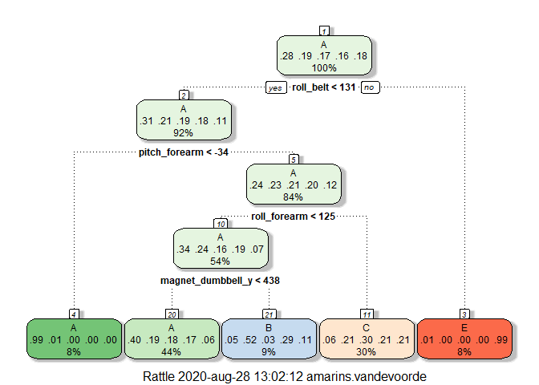

### Synopsis
In this article, a dataset regarding personal activity is investigated. 6 participants have taken measurements while performing barbell lifts, with accelerometers on the belt, forearm, arm, and dumbell. The data of these 4 accelerometers has been recorded, as well as a statement whether the exercise was performed correctly or incorrectly and in the latter case, in what way. This exercise classe has been recorded in the 'classe' variable. The goal of this article is to analyse the dataset and set up a model that will correctly predict the exercise classe for a second dataset that doesn't contain the classe variable.
For predicting the classe types, 3 prediction methods have been tested: prediction with a tree, prediction with boosting and prediction based on random forests. The resulting predictions should have an accuracy of at least 95%.
Both the second and the third prediction method, based on boosting and random forest, respectively, have an accuracy of over 95%. Both models have been used to predict the classe type for the validation dataset. The predicted classe types have been compared to the real values, by submitting them in the course prediction quiz. The third model had a score of 14/20 correct predictions and the second model a score of 20/20 correct predictions. We can conclude that the third model is overfitting the data and that the second model, based on boosting, is accurate enough to predict all validation classe types correct.

### Processing the data
#### Loading the dataset
The dataset consists of a training dataset and a testing dataset. The latter doesn't contain the _classe_ variable and has been used for validation. Hence, the training dataset has been split into a training and testing dataset. Code for loading the data is included in Appendix A01.


#### Processing the datasets
Some exploratory analysis was done on both the training and validation datasets, to investigate what kind of data has been included in the dataset. Full analyses have been included in appendix A02. 
The analyses show that both datasets contain almost the same columns. The only difference is that training contains column _classe_ and testing contains column _problem_id_ instead.
It appears that the _classe_ variable has been stored as a character. It will be converted to a factor variable, for easier processing.  
Further analysis shows that quite a number of columns don't seem to contain data. Looking at the full data frame confirms that these columns only contain data when field _new_window_ has value "yes". The headers of these columns seem to refer to statistical values, like average, sum or skewness, rather than to measured values. It appears as though the rows with _new_window_ value set to "yes" contain statistics. All these columns, as well as the "yes" rows have been excluded from the dataset, as the values are sparse and most likely dependent on the original measures.  
The first 7 columns of  the dataset seem to contain information about the measurement, rather than measured values, i.e. name of the participant, moment of exercise, etc. As these won't be relevant to the prediction, these columns have been removed from the datasets as well.
The resulting training, testing and validation dataset only contain measured values on the exercise and the _classe_ variable. 


### Fitting models
As the goal is to predict in which manner the participants did their exercise, the model will have to predict _classe_. Desired accuracy of the model is 95% or higher. Code for all 3 models has been included in appendix A04.

The first fitted model is a tree. The accuracy was only 49%, so a different model is required.

```
##  Accuracy 
## 0.4814661
```

<!-- -->

The second fitted model uses boosting. Its accuracy is about 96%, which is a lot better. We will see if we can find a model with even higher accuracy.

```
##    user  system elapsed 
##   52.65    0.67  211.64
```

```
## Confusion Matrix and Statistics
## 
##           Reference
## Prediction    A    B    C    D    E
##          A 1352   25    0    0    4
##          B   15  863   17    0   13
##          C    8   27  809   24    8
##          D    0    2   14  754   19
##          E    2    3    0    6  837
## 
## Overall Statistics
##                                           
##                Accuracy : 0.9611          
##                  95% CI : (0.9552, 0.9664)
##     No Information Rate : 0.2868          
##     P-Value [Acc > NIR] : < 2.2e-16       
##                                           
##                   Kappa : 0.9507          
##                                           
##  Mcnemar's Test P-Value : NA              
## 
## Statistics by Class:
## 
##                      Class: A Class: B Class: C Class: D Class: E
## Sensitivity            0.9818   0.9380   0.9631   0.9617   0.9501
## Specificity            0.9915   0.9884   0.9831   0.9913   0.9972
## Pos Pred Value         0.9790   0.9504   0.9235   0.9556   0.9870
## Neg Pred Value         0.9927   0.9854   0.9921   0.9925   0.9889
## Prevalence             0.2868   0.1916   0.1749   0.1633   0.1835
## Detection Rate         0.2815   0.1797   0.1685   0.1570   0.1743
## Detection Prevalence   0.2876   0.1891   0.1824   0.1643   0.1766
## Balanced Accuracy      0.9867   0.9632   0.9731   0.9765   0.9736
```

The third fitted model is based on random forests. Its accuracy is about 99.5% and should therefore do well in predicting the classe type of the validation set correctly. We have to be wary of such a high accuracy percentage, as it might indicate overfitting of the model.

```
##    user  system elapsed 
##   53.83    1.92  682.64
```

```
## Confusion Matrix and Statistics
## 
##           Reference
## Prediction    A    B    C    D    E
##          A 1372    3    0    0    0
##          B    5  916    2    0    0
##          C    0    1  838   11    0
##          D    0    0    0  772    5
##          E    0    0    0    1  876
## 
## Overall Statistics
##                                           
##                Accuracy : 0.9942          
##                  95% CI : (0.9916, 0.9961)
##     No Information Rate : 0.2868          
##     P-Value [Acc > NIR] : < 2.2e-16       
##                                           
##                   Kappa : 0.9926          
##                                           
##  Mcnemar's Test P-Value : NA              
## 
## Statistics by Class:
## 
##                      Class: A Class: B Class: C Class: D Class: E
## Sensitivity            0.9964   0.9957   0.9976   0.9847   0.9943
## Specificity            0.9991   0.9982   0.9970   0.9988   0.9997
## Pos Pred Value         0.9978   0.9924   0.9859   0.9936   0.9989
## Neg Pred Value         0.9985   0.9990   0.9995   0.9970   0.9987
## Prevalence             0.2868   0.1916   0.1749   0.1633   0.1835
## Detection Rate         0.2857   0.1908   0.1745   0.1608   0.1824
## Detection Prevalence   0.2863   0.1922   0.1770   0.1618   0.1826
## Balanced Accuracy      0.9977   0.9969   0.9973   0.9917   0.9970
```


### Results
As the third model has a very high accuracy 
The third model, based on random trees, as well as the second model, based on boosting, will be used to predict the classe type for the Validation dataset. We will show the resulting predictions as well as the number of correct predictions for each set.
Both the 2nd and the  3rd model, based on random forests, will be used to predict the classe type for the Validation set. Code for the predictions is included in appendix A05. The resulting predictions are:

```
## [1] 20
```

```
## [1] 20
```


### Source of the data
The data for this project is the _Weight Lifting Exercise Database_, gathered from http://web.archive.org/web/20161224072740/http:/groupware.les.inf.puc-rio.br/har. 


### Appendix
#### A01 Loading packages and data; creating partitions

```r
list.of.packages <- c("caret","rattle","randomForest","klaR","doParallel","parallel")
new.packages <- list.of.packages[!(list.of.packages %in% installed.packages()[,"Package"])]
if(length(new.packages)) install.packages(new.packages)
invisible(lapply(list.of.packages,require,character.only=TRUE))
```


```r
train_url="https://d396qusza40orc.cloudfront.net/predmachlearn/pml-training.csv"
test_url="https://d396qusza40orc.cloudfront.net/predmachlearn/pml-testing.csv"
train<-read.csv(train_url)
validation<-read.csv(test_url)
set.seed(1234)
```


```r
inTrain<-createDataPartition(y=train$classe,p=0.75,list=FALSE)
training<-train[inTrain,]
testing<-train[-inTrain,]
```

#### A02 Exploratory analysis

```r
head(training,n=3L)
```

```
##   X user_name raw_timestamp_part_1 raw_timestamp_part_2   cvtd_timestamp
## 1 1  carlitos           1323084231               788290 05/12/2011 11:23
## 2 2  carlitos           1323084231               808298 05/12/2011 11:23
## 3 3  carlitos           1323084231               820366 05/12/2011 11:23
##   new_window num_window roll_belt pitch_belt yaw_belt total_accel_belt
## 1         no         11      1.41       8.07    -94.4                3
## 2         no         11      1.41       8.07    -94.4                3
## 3         no         11      1.42       8.07    -94.4                3
##   kurtosis_roll_belt kurtosis_picth_belt kurtosis_yaw_belt skewness_roll_belt
## 1                                                                            
## 2                                                                            
## 3                                                                            
##   skewness_roll_belt.1 skewness_yaw_belt max_roll_belt max_picth_belt
## 1                                                   NA             NA
## 2                                                   NA             NA
## 3                                                   NA             NA
##   max_yaw_belt min_roll_belt min_pitch_belt min_yaw_belt amplitude_roll_belt
## 1                         NA             NA                               NA
## 2                         NA             NA                               NA
## 3                         NA             NA                               NA
##   amplitude_pitch_belt amplitude_yaw_belt var_total_accel_belt avg_roll_belt
## 1                   NA                                      NA            NA
## 2                   NA                                      NA            NA
## 3                   NA                                      NA            NA
##   stddev_roll_belt var_roll_belt avg_pitch_belt stddev_pitch_belt
## 1               NA            NA             NA                NA
## 2               NA            NA             NA                NA
## 3               NA            NA             NA                NA
##   var_pitch_belt avg_yaw_belt stddev_yaw_belt var_yaw_belt gyros_belt_x
## 1             NA           NA              NA           NA         0.00
## 2             NA           NA              NA           NA         0.02
## 3             NA           NA              NA           NA         0.00
##   gyros_belt_y gyros_belt_z accel_belt_x accel_belt_y accel_belt_z
## 1            0        -0.02          -21            4           22
## 2            0        -0.02          -22            4           22
## 3            0        -0.02          -20            5           23
##   magnet_belt_x magnet_belt_y magnet_belt_z roll_arm pitch_arm yaw_arm
## 1            -3           599          -313     -128      22.5    -161
## 2            -7           608          -311     -128      22.5    -161
## 3            -2           600          -305     -128      22.5    -161
##   total_accel_arm var_accel_arm avg_roll_arm stddev_roll_arm var_roll_arm
## 1              34            NA           NA              NA           NA
## 2              34            NA           NA              NA           NA
## 3              34            NA           NA              NA           NA
##   avg_pitch_arm stddev_pitch_arm var_pitch_arm avg_yaw_arm stddev_yaw_arm
## 1            NA               NA            NA          NA             NA
## 2            NA               NA            NA          NA             NA
## 3            NA               NA            NA          NA             NA
##   var_yaw_arm gyros_arm_x gyros_arm_y gyros_arm_z accel_arm_x accel_arm_y
## 1          NA        0.00        0.00       -0.02        -288         109
## 2          NA        0.02       -0.02       -0.02        -290         110
## 3          NA        0.02       -0.02       -0.02        -289         110
##   accel_arm_z magnet_arm_x magnet_arm_y magnet_arm_z kurtosis_roll_arm
## 1        -123         -368          337          516                  
## 2        -125         -369          337          513                  
## 3        -126         -368          344          513                  
##   kurtosis_picth_arm kurtosis_yaw_arm skewness_roll_arm skewness_pitch_arm
## 1                                                                         
## 2                                                                         
## 3                                                                         
##   skewness_yaw_arm max_roll_arm max_picth_arm max_yaw_arm min_roll_arm
## 1                            NA            NA          NA           NA
## 2                            NA            NA          NA           NA
## 3                            NA            NA          NA           NA
##   min_pitch_arm min_yaw_arm amplitude_roll_arm amplitude_pitch_arm
## 1            NA          NA                 NA                  NA
## 2            NA          NA                 NA                  NA
## 3            NA          NA                 NA                  NA
##   amplitude_yaw_arm roll_dumbbell pitch_dumbbell yaw_dumbbell
## 1                NA      13.05217      -70.49400    -84.87394
## 2                NA      13.13074      -70.63751    -84.71065
## 3                NA      12.85075      -70.27812    -85.14078
##   kurtosis_roll_dumbbell kurtosis_picth_dumbbell kurtosis_yaw_dumbbell
## 1                                                                     
## 2                                                                     
## 3                                                                     
##   skewness_roll_dumbbell skewness_pitch_dumbbell skewness_yaw_dumbbell
## 1                                                                     
## 2                                                                     
## 3                                                                     
##   max_roll_dumbbell max_picth_dumbbell max_yaw_dumbbell min_roll_dumbbell
## 1                NA                 NA                                 NA
## 2                NA                 NA                                 NA
## 3                NA                 NA                                 NA
##   min_pitch_dumbbell min_yaw_dumbbell amplitude_roll_dumbbell
## 1                 NA                                       NA
## 2                 NA                                       NA
## 3                 NA                                       NA
##   amplitude_pitch_dumbbell amplitude_yaw_dumbbell total_accel_dumbbell
## 1                       NA                                          37
## 2                       NA                                          37
## 3                       NA                                          37
##   var_accel_dumbbell avg_roll_dumbbell stddev_roll_dumbbell var_roll_dumbbell
## 1                 NA                NA                   NA                NA
## 2                 NA                NA                   NA                NA
## 3                 NA                NA                   NA                NA
##   avg_pitch_dumbbell stddev_pitch_dumbbell var_pitch_dumbbell avg_yaw_dumbbell
## 1                 NA                    NA                 NA               NA
## 2                 NA                    NA                 NA               NA
## 3                 NA                    NA                 NA               NA
##   stddev_yaw_dumbbell var_yaw_dumbbell gyros_dumbbell_x gyros_dumbbell_y
## 1                  NA               NA                0            -0.02
## 2                  NA               NA                0            -0.02
## 3                  NA               NA                0            -0.02
##   gyros_dumbbell_z accel_dumbbell_x accel_dumbbell_y accel_dumbbell_z
## 1                0             -234               47             -271
## 2                0             -233               47             -269
## 3                0             -232               46             -270
##   magnet_dumbbell_x magnet_dumbbell_y magnet_dumbbell_z roll_forearm
## 1              -559               293               -65         28.4
## 2              -555               296               -64         28.3
## 3              -561               298               -63         28.3
##   pitch_forearm yaw_forearm kurtosis_roll_forearm kurtosis_picth_forearm
## 1         -63.9        -153                                             
## 2         -63.9        -153                                             
## 3         -63.9        -152                                             
##   kurtosis_yaw_forearm skewness_roll_forearm skewness_pitch_forearm
## 1                                                                  
## 2                                                                  
## 3                                                                  
##   skewness_yaw_forearm max_roll_forearm max_picth_forearm max_yaw_forearm
## 1                                    NA                NA                
## 2                                    NA                NA                
## 3                                    NA                NA                
##   min_roll_forearm min_pitch_forearm min_yaw_forearm amplitude_roll_forearm
## 1               NA                NA                                     NA
## 2               NA                NA                                     NA
## 3               NA                NA                                     NA
##   amplitude_pitch_forearm amplitude_yaw_forearm total_accel_forearm
## 1                      NA                                        36
## 2                      NA                                        36
## 3                      NA                                        36
##   var_accel_forearm avg_roll_forearm stddev_roll_forearm var_roll_forearm
## 1                NA               NA                  NA               NA
## 2                NA               NA                  NA               NA
## 3                NA               NA                  NA               NA
##   avg_pitch_forearm stddev_pitch_forearm var_pitch_forearm avg_yaw_forearm
## 1                NA                   NA                NA              NA
## 2                NA                   NA                NA              NA
## 3                NA                   NA                NA              NA
##   stddev_yaw_forearm var_yaw_forearm gyros_forearm_x gyros_forearm_y
## 1                 NA              NA            0.03            0.00
## 2                 NA              NA            0.02            0.00
## 3                 NA              NA            0.03           -0.02
##   gyros_forearm_z accel_forearm_x accel_forearm_y accel_forearm_z
## 1           -0.02             192             203            -215
## 2           -0.02             192             203            -216
## 3            0.00             196             204            -213
##   magnet_forearm_x magnet_forearm_y magnet_forearm_z classe
## 1              -17              654              476      A
## 2              -18              661              473      A
## 3              -18              658              469      A
```

```r
colnames(validation)
```

```
##   [1] "X"                        "user_name"               
##   [3] "raw_timestamp_part_1"     "raw_timestamp_part_2"    
##   [5] "cvtd_timestamp"           "new_window"              
##   [7] "num_window"               "roll_belt"               
##   [9] "pitch_belt"               "yaw_belt"                
##  [11] "total_accel_belt"         "kurtosis_roll_belt"      
##  [13] "kurtosis_picth_belt"      "kurtosis_yaw_belt"       
##  [15] "skewness_roll_belt"       "skewness_roll_belt.1"    
##  [17] "skewness_yaw_belt"        "max_roll_belt"           
##  [19] "max_picth_belt"           "max_yaw_belt"            
##  [21] "min_roll_belt"            "min_pitch_belt"          
##  [23] "min_yaw_belt"             "amplitude_roll_belt"     
##  [25] "amplitude_pitch_belt"     "amplitude_yaw_belt"      
##  [27] "var_total_accel_belt"     "avg_roll_belt"           
##  [29] "stddev_roll_belt"         "var_roll_belt"           
##  [31] "avg_pitch_belt"           "stddev_pitch_belt"       
##  [33] "var_pitch_belt"           "avg_yaw_belt"            
##  [35] "stddev_yaw_belt"          "var_yaw_belt"            
##  [37] "gyros_belt_x"             "gyros_belt_y"            
##  [39] "gyros_belt_z"             "accel_belt_x"            
##  [41] "accel_belt_y"             "accel_belt_z"            
##  [43] "magnet_belt_x"            "magnet_belt_y"           
##  [45] "magnet_belt_z"            "roll_arm"                
##  [47] "pitch_arm"                "yaw_arm"                 
##  [49] "total_accel_arm"          "var_accel_arm"           
##  [51] "avg_roll_arm"             "stddev_roll_arm"         
##  [53] "var_roll_arm"             "avg_pitch_arm"           
##  [55] "stddev_pitch_arm"         "var_pitch_arm"           
##  [57] "avg_yaw_arm"              "stddev_yaw_arm"          
##  [59] "var_yaw_arm"              "gyros_arm_x"             
##  [61] "gyros_arm_y"              "gyros_arm_z"             
##  [63] "accel_arm_x"              "accel_arm_y"             
##  [65] "accel_arm_z"              "magnet_arm_x"            
##  [67] "magnet_arm_y"             "magnet_arm_z"            
##  [69] "kurtosis_roll_arm"        "kurtosis_picth_arm"      
##  [71] "kurtosis_yaw_arm"         "skewness_roll_arm"       
##  [73] "skewness_pitch_arm"       "skewness_yaw_arm"        
##  [75] "max_roll_arm"             "max_picth_arm"           
##  [77] "max_yaw_arm"              "min_roll_arm"            
##  [79] "min_pitch_arm"            "min_yaw_arm"             
##  [81] "amplitude_roll_arm"       "amplitude_pitch_arm"     
##  [83] "amplitude_yaw_arm"        "roll_dumbbell"           
##  [85] "pitch_dumbbell"           "yaw_dumbbell"            
##  [87] "kurtosis_roll_dumbbell"   "kurtosis_picth_dumbbell" 
##  [89] "kurtosis_yaw_dumbbell"    "skewness_roll_dumbbell"  
##  [91] "skewness_pitch_dumbbell"  "skewness_yaw_dumbbell"   
##  [93] "max_roll_dumbbell"        "max_picth_dumbbell"      
##  [95] "max_yaw_dumbbell"         "min_roll_dumbbell"       
##  [97] "min_pitch_dumbbell"       "min_yaw_dumbbell"        
##  [99] "amplitude_roll_dumbbell"  "amplitude_pitch_dumbbell"
## [101] "amplitude_yaw_dumbbell"   "total_accel_dumbbell"    
## [103] "var_accel_dumbbell"       "avg_roll_dumbbell"       
## [105] "stddev_roll_dumbbell"     "var_roll_dumbbell"       
## [107] "avg_pitch_dumbbell"       "stddev_pitch_dumbbell"   
## [109] "var_pitch_dumbbell"       "avg_yaw_dumbbell"        
## [111] "stddev_yaw_dumbbell"      "var_yaw_dumbbell"        
## [113] "gyros_dumbbell_x"         "gyros_dumbbell_y"        
## [115] "gyros_dumbbell_z"         "accel_dumbbell_x"        
## [117] "accel_dumbbell_y"         "accel_dumbbell_z"        
## [119] "magnet_dumbbell_x"        "magnet_dumbbell_y"       
## [121] "magnet_dumbbell_z"        "roll_forearm"            
## [123] "pitch_forearm"            "yaw_forearm"             
## [125] "kurtosis_roll_forearm"    "kurtosis_picth_forearm"  
## [127] "kurtosis_yaw_forearm"     "skewness_roll_forearm"   
## [129] "skewness_pitch_forearm"   "skewness_yaw_forearm"    
## [131] "max_roll_forearm"         "max_picth_forearm"       
## [133] "max_yaw_forearm"          "min_roll_forearm"        
## [135] "min_pitch_forearm"        "min_yaw_forearm"         
## [137] "amplitude_roll_forearm"   "amplitude_pitch_forearm" 
## [139] "amplitude_yaw_forearm"    "total_accel_forearm"     
## [141] "var_accel_forearm"        "avg_roll_forearm"        
## [143] "stddev_roll_forearm"      "var_roll_forearm"        
## [145] "avg_pitch_forearm"        "stddev_pitch_forearm"    
## [147] "var_pitch_forearm"        "avg_yaw_forearm"         
## [149] "stddev_yaw_forearm"       "var_yaw_forearm"         
## [151] "gyros_forearm_x"          "gyros_forearm_y"         
## [153] "gyros_forearm_z"          "accel_forearm_x"         
## [155] "accel_forearm_y"          "accel_forearm_z"         
## [157] "magnet_forearm_x"         "magnet_forearm_y"        
## [159] "magnet_forearm_z"         "problem_id"
```

```r
summary(training)
```

```
##        X          user_name         raw_timestamp_part_1 raw_timestamp_part_2
##  Min.   :    1   Length:14718       Min.   :1.322e+09    Min.   :   301      
##  1st Qu.: 4894   Class :character   1st Qu.:1.323e+09    1st Qu.:252323      
##  Median : 9821   Mode  :character   Median :1.323e+09    Median :496343      
##  Mean   : 9815                      Mean   :1.323e+09    Mean   :499749      
##  3rd Qu.:14740                      3rd Qu.:1.323e+09    3rd Qu.:748366      
##  Max.   :19622                      Max.   :1.323e+09    Max.   :998801      
##                                                                              
##  cvtd_timestamp      new_window          num_window      roll_belt     
##  Length:14718       Length:14718       Min.   :  1.0   Min.   :-28.80  
##  Class :character   Class :character   1st Qu.:223.0   1st Qu.:  1.09  
##  Mode  :character   Mode  :character   Median :425.0   Median :113.00  
##                                        Mean   :431.4   Mean   : 64.43  
##                                        3rd Qu.:645.0   3rd Qu.:123.00  
##                                        Max.   :864.0   Max.   :162.00  
##                                                                        
##    pitch_belt          yaw_belt       total_accel_belt kurtosis_roll_belt
##  Min.   :-55.8000   Min.   :-180.00   Min.   : 0.00    Length:14718      
##  1st Qu.:  1.7800   1st Qu.: -88.30   1st Qu.: 3.00    Class :character  
##  Median :  5.2700   Median : -13.00   Median :17.00    Mode  :character  
##  Mean   :  0.3464   Mean   : -11.19   Mean   :11.31                      
##  3rd Qu.: 14.9000   3rd Qu.:  12.90   3rd Qu.:18.00                      
##  Max.   : 60.3000   Max.   : 179.00   Max.   :29.00                      
##                                                                          
##  kurtosis_picth_belt kurtosis_yaw_belt  skewness_roll_belt skewness_roll_belt.1
##  Length:14718        Length:14718       Length:14718       Length:14718        
##  Class :character    Class :character   Class :character   Class :character    
##  Mode  :character    Mode  :character   Mode  :character   Mode  :character    
##                                                                                
##                                                                                
##                                                                                
##                                                                                
##  skewness_yaw_belt  max_roll_belt    max_picth_belt  max_yaw_belt      
##  Length:14718       Min.   :-94.30   Min.   : 3.00   Length:14718      
##  Class :character   1st Qu.:-88.00   1st Qu.: 5.00   Class :character  
##  Mode  :character   Median : -6.00   Median :18.00   Mode  :character  
##                     Mean   :-10.05   Mean   :12.65                     
##                     3rd Qu.:  7.10   3rd Qu.:19.00                     
##                     Max.   :180.00   Max.   :30.00                     
##                     NA's   :14414    NA's   :14414                     
##  min_roll_belt      min_pitch_belt  min_yaw_belt       amplitude_roll_belt
##  Min.   :-180.000   Min.   : 0.00   Length:14718       Min.   :  0.000    
##  1st Qu.: -88.400   1st Qu.: 3.00   Class :character   1st Qu.:  0.300    
##  Median : -10.750   Median :16.00   Mode  :character   Median :  1.000    
##  Mean   : -13.201   Mean   :10.64                      Mean   :  3.151    
##  3rd Qu.:   2.675   3rd Qu.:17.00                      3rd Qu.:  2.007    
##  Max.   : 173.000   Max.   :23.00                      Max.   :360.000    
##  NA's   :14414      NA's   :14414                      NA's   :14414      
##  amplitude_pitch_belt amplitude_yaw_belt var_total_accel_belt avg_roll_belt   
##  Min.   : 0.00        Length:14718       Min.   : 0.000       Min.   :-27.40  
##  1st Qu.: 1.00        Class :character   1st Qu.: 0.100       1st Qu.:  1.20  
##  Median : 1.00        Mode  :character   Median : 0.200       Median :115.35  
##  Mean   : 2.01                           Mean   : 0.761       Mean   : 66.77  
##  3rd Qu.: 2.00                           3rd Qu.: 0.300       3rd Qu.:123.02  
##  Max.   :11.00                           Max.   :12.600       Max.   :157.40  
##  NA's   :14414                           NA's   :14414        NA's   :14414   
##  stddev_roll_belt var_roll_belt     avg_pitch_belt    stddev_pitch_belt
##  Min.   : 0.000   Min.   :  0.000   Min.   :-46.900   Min.   :0.000    
##  1st Qu.: 0.200   1st Qu.:  0.000   1st Qu.:  2.525   1st Qu.:0.200    
##  Median : 0.400   Median :  0.100   Median :  5.500   Median :0.322    
##  Mean   : 1.213   Mean   :  6.367   Mean   :  1.385   Mean   :0.595    
##  3rd Qu.: 0.700   3rd Qu.:  0.455   3rd Qu.: 16.000   3rd Qu.:0.700    
##  Max.   :14.200   Max.   :200.700   Max.   : 59.700   Max.   :3.600    
##  NA's   :14414    NA's   :14414     NA's   :14414     NA's   :14414    
##  var_pitch_belt    avg_yaw_belt     stddev_yaw_belt    var_yaw_belt      
##  Min.   : 0.000   Min.   :-94.400   Min.   :  0.000   Min.   :    0.000  
##  1st Qu.: 0.000   1st Qu.:-88.125   1st Qu.:  0.100   1st Qu.:    0.010  
##  Median : 0.100   Median : -7.450   Median :  0.300   Median :    0.090  
##  Mean   : 0.754   Mean   :-11.530   Mean   :  1.212   Mean   :  103.935  
##  3rd Qu.: 0.500   3rd Qu.:  6.025   3rd Qu.:  0.700   3rd Qu.:    0.452  
##  Max.   :13.100   Max.   :173.500   Max.   :176.600   Max.   :31183.240  
##  NA's   :14414    NA's   :14414     NA's   :14414     NA's   :14414      
##   gyros_belt_x      gyros_belt_y       gyros_belt_z      accel_belt_x     
##  Min.   :-1.0000   Min.   :-0.64000   Min.   :-1.4600   Min.   :-120.000  
##  1st Qu.:-0.0300   1st Qu.: 0.00000   1st Qu.:-0.2000   1st Qu.: -21.000  
##  Median : 0.0300   Median : 0.02000   Median :-0.1000   Median : -15.000  
##  Mean   :-0.0058   Mean   : 0.03949   Mean   :-0.1307   Mean   :  -5.621  
##  3rd Qu.: 0.1100   3rd Qu.: 0.11000   3rd Qu.:-0.0200   3rd Qu.:  -5.000  
##  Max.   : 2.2200   Max.   : 0.64000   Max.   : 1.6200   Max.   :  85.000  
##                                                                           
##   accel_belt_y     accel_belt_z     magnet_belt_x    magnet_belt_y  
##  Min.   :-69.00   Min.   :-275.00   Min.   :-52.00   Min.   :354.0  
##  1st Qu.:  3.00   1st Qu.:-162.00   1st Qu.:  9.00   1st Qu.:581.0  
##  Median : 35.00   Median :-152.00   Median : 35.00   Median :601.0  
##  Mean   : 30.16   Mean   : -72.63   Mean   : 55.49   Mean   :593.7  
##  3rd Qu.: 61.00   3rd Qu.:  27.00   3rd Qu.: 60.00   3rd Qu.:610.0  
##  Max.   :164.00   Max.   : 105.00   Max.   :485.00   Max.   :673.0  
##                                                                     
##  magnet_belt_z       roll_arm         pitch_arm          yaw_arm         
##  Min.   :-623.0   Min.   :-180.00   Min.   :-88.800   Min.   :-180.0000  
##  1st Qu.:-375.0   1st Qu.: -31.10   1st Qu.:-26.000   1st Qu.: -42.7000  
##  Median :-320.0   Median :   0.00   Median :  0.000   Median :   0.0000  
##  Mean   :-345.6   Mean   :  18.28   Mean   : -4.726   Mean   :  -0.7516  
##  3rd Qu.:-306.0   3rd Qu.:  77.67   3rd Qu.: 11.000   3rd Qu.:  45.2750  
##  Max.   : 289.0   Max.   : 180.00   Max.   : 88.500   Max.   : 180.0000  
##                                                                          
##  total_accel_arm var_accel_arm      avg_roll_arm     stddev_roll_arm  
##  Min.   : 1.00   Min.   :  0.000   Min.   :-166.67   Min.   :  0.000  
##  1st Qu.:17.00   1st Qu.:  5.973   1st Qu.: -38.51   1st Qu.:  1.280  
##  Median :27.00   Median : 38.767   Median :   0.00   Median :  5.847  
##  Mean   :25.45   Mean   : 51.980   Mean   :  13.37   Mean   : 10.915  
##  3rd Qu.:33.00   3rd Qu.: 75.544   3rd Qu.:  77.89   3rd Qu.: 16.886  
##  Max.   :65.00   Max.   :331.699   Max.   : 163.33   Max.   :161.452  
##                  NA's   :14414     NA's   :14414     NA's   :14414    
##   var_roll_arm      avg_pitch_arm     stddev_pitch_arm var_pitch_arm     
##  Min.   :    0.00   Min.   :-81.773   Min.   : 0.000   Min.   :   0.000  
##  1st Qu.:    1.64   1st Qu.:-24.319   1st Qu.: 1.432   1st Qu.:   2.055  
##  Median :   34.19   Median :  0.000   Median : 7.730   Median :  59.757  
##  Mean   :  360.60   Mean   : -5.043   Mean   : 9.808   Mean   : 175.672  
##  3rd Qu.:  285.16   3rd Qu.:  7.725   3rd Qu.:15.163   3rd Qu.: 229.927  
##  Max.   :26066.58   Max.   : 75.659   Max.   :43.412   Max.   :1884.565  
##  NA's   :14414      NA's   :14414     NA's   :14414    NA's   :14414     
##   avg_yaw_arm       stddev_yaw_arm    var_yaw_arm         gyros_arm_x      
##  Min.   :-173.440   Min.   :  0.00   Min.   :    0.000   Min.   :-6.37000  
##  1st Qu.: -30.719   1st Qu.:  2.18   1st Qu.:    4.752   1st Qu.:-1.35000  
##  Median :   0.000   Median : 17.47   Median :  305.095   Median : 0.06000  
##  Mean   :   2.908   Mean   : 22.06   Mean   : 1016.071   Mean   : 0.02084  
##  3rd Qu.:  38.858   3rd Qu.: 35.94   3rd Qu.: 1291.327   3rd Qu.: 1.56000  
##  Max.   : 152.000   Max.   :163.26   Max.   :26653.192   Max.   : 4.87000  
##  NA's   :14414      NA's   :14414    NA's   :14414                         
##   gyros_arm_y       gyros_arm_z       accel_arm_x       accel_arm_y     
##  Min.   :-3.4400   Min.   :-2.1700   Min.   :-404.00   Min.   :-315.00  
##  1st Qu.:-0.7900   1st Qu.:-0.0700   1st Qu.:-242.00   1st Qu.: -54.00  
##  Median :-0.2400   Median : 0.2300   Median : -43.00   Median :  14.00  
##  Mean   :-0.2485   Mean   : 0.2689   Mean   : -59.65   Mean   :  32.81  
##  3rd Qu.: 0.1600   3rd Qu.: 0.7200   3rd Qu.:  84.00   3rd Qu.: 139.00  
##  Max.   : 2.8400   Max.   : 3.0200   Max.   : 437.00   Max.   : 303.00  
##                                                                         
##   accel_arm_z       magnet_arm_x     magnet_arm_y     magnet_arm_z   
##  Min.   :-630.00   Min.   :-584.0   Min.   :-392.0   Min.   :-597.0  
##  1st Qu.:-143.00   1st Qu.:-300.0   1st Qu.:  -9.0   1st Qu.: 129.2  
##  Median : -47.00   Median : 295.0   Median : 201.0   Median : 443.0  
##  Mean   : -70.72   Mean   : 193.7   Mean   : 156.6   Mean   : 306.8  
##  3rd Qu.:  24.00   3rd Qu.: 639.0   3rd Qu.: 322.0   3rd Qu.: 544.0  
##  Max.   : 292.00   Max.   : 780.0   Max.   : 583.0   Max.   : 693.0  
##                                                                      
##  kurtosis_roll_arm  kurtosis_picth_arm kurtosis_yaw_arm   skewness_roll_arm 
##  Length:14718       Length:14718       Length:14718       Length:14718      
##  Class :character   Class :character   Class :character   Class :character  
##  Mode  :character   Mode  :character   Mode  :character   Mode  :character  
##                                                                             
##                                                                             
##                                                                             
##                                                                             
##  skewness_pitch_arm skewness_yaw_arm    max_roll_arm    max_picth_arm    
##  Length:14718       Length:14718       Min.   :-73.10   Min.   :-173.00  
##  Class :character   Class :character   1st Qu.: -1.25   1st Qu.:  -0.20  
##  Mode  :character   Mode  :character   Median :  4.80   Median :  31.90  
##                                        Mean   : 10.22   Mean   :  35.73  
##                                        3rd Qu.: 25.95   3rd Qu.:  95.92  
##                                        Max.   : 85.50   Max.   : 180.00  
##                                        NA's   :14414    NA's   :14414    
##   max_yaw_arm     min_roll_arm    min_pitch_arm      min_yaw_arm   
##  Min.   : 4.00   Min.   :-89.10   Min.   :-180.00   Min.   : 1.00  
##  1st Qu.:30.00   1st Qu.:-41.75   1st Qu.: -72.15   1st Qu.: 8.00  
##  Median :34.00   Median :-22.70   Median : -34.15   Median :13.00  
##  Mean   :35.46   Mean   :-20.52   Mean   : -33.30   Mean   :15.26  
##  3rd Qu.:41.00   3rd Qu.:  0.00   3rd Qu.:   0.00   3rd Qu.:20.00  
##  Max.   :65.00   Max.   : 66.40   Max.   : 152.00   Max.   :38.00  
##  NA's   :14414   NA's   :14414    NA's   :14414     NA's   :14414  
##  amplitude_roll_arm amplitude_pitch_arm amplitude_yaw_arm roll_dumbbell    
##  Min.   :  0.000    Min.   :  0.00      Min.   : 0.0      Min.   :-153.51  
##  1st Qu.:  5.175    1st Qu.:  9.60      1st Qu.: 9.0      1st Qu.: -18.47  
##  Median : 27.560    Median : 56.60      Median :21.0      Median :  48.04  
##  Mean   : 30.743    Mean   : 69.03      Mean   :20.2      Mean   :  23.62  
##  3rd Qu.: 48.730    3rd Qu.:114.50      3rd Qu.:29.0      3rd Qu.:  67.32  
##  Max.   :118.000    Max.   :359.00      Max.   :51.0      Max.   : 153.55  
##  NA's   :14414      NA's   :14414       NA's   :14414                      
##  pitch_dumbbell     yaw_dumbbell      kurtosis_roll_dumbbell
##  Min.   :-134.73   Min.   :-150.871   Length:14718          
##  1st Qu.: -40.92   1st Qu.: -77.601   Class :character      
##  Median : -21.28   Median :  -3.067   Mode  :character      
##  Mean   : -10.89   Mean   :   1.795                         
##  3rd Qu.:  17.34   3rd Qu.:  80.174                         
##  Max.   : 137.03   Max.   : 154.223                         
##                                                             
##  kurtosis_picth_dumbbell kurtosis_yaw_dumbbell skewness_roll_dumbbell
##  Length:14718            Length:14718          Length:14718          
##  Class :character        Class :character      Class :character      
##  Mode  :character        Mode  :character      Mode  :character      
##                                                                      
##                                                                      
##                                                                      
##                                                                      
##  skewness_pitch_dumbbell skewness_yaw_dumbbell max_roll_dumbbell
##  Length:14718            Length:14718          Min.   :-70.10   
##  Class :character        Class :character      1st Qu.:-27.38   
##  Mode  :character        Mode  :character      Median : 13.85   
##                                                Mean   : 14.06   
##                                                3rd Qu.: 50.85   
##                                                Max.   :137.00   
##                                                NA's   :14414    
##  max_picth_dumbbell max_yaw_dumbbell   min_roll_dumbbell min_pitch_dumbbell
##  Min.   :-112.90    Length:14718       Min.   :-134.90   Min.   :-146.20   
##  1st Qu.: -65.65    Class :character   1st Qu.: -60.48   1st Qu.: -89.50   
##  Median :  48.50    Mode  :character   Median : -45.35   Median : -52.25   
##  Mean   :  36.04                       Mean   : -41.40   Mean   : -33.51   
##  3rd Qu.: 133.55                       3rd Qu.: -27.95   3rd Qu.:  16.40   
##  Max.   : 154.50                       Max.   :  73.20   Max.   : 120.90   
##  NA's   :14414                         NA's   :14414     NA's   :14414     
##  min_yaw_dumbbell   amplitude_roll_dumbbell amplitude_pitch_dumbbell
##  Length:14718       Min.   :  0.00          Min.   :  0.00          
##  Class :character   1st Qu.: 15.18          1st Qu.: 17.65          
##  Mode  :character   Median : 36.44          Median : 42.74          
##                     Mean   : 55.46          Mean   : 69.55          
##                     3rd Qu.: 87.92          3rd Qu.:113.67          
##                     Max.   :232.79          Max.   :273.59          
##                     NA's   :14414           NA's   :14414           
##  amplitude_yaw_dumbbell total_accel_dumbbell var_accel_dumbbell
##  Length:14718           Min.   : 0.00        Min.   : 0.000    
##  Class :character       1st Qu.: 4.00        1st Qu.: 0.358    
##  Mode  :character       Median :10.00        Median : 0.950    
##                         Mean   :13.72        Mean   : 3.863    
##                         3rd Qu.:19.00        3rd Qu.: 3.314    
##                         Max.   :58.00        Max.   :64.175    
##                                              NA's   :14414     
##  avg_roll_dumbbell stddev_roll_dumbbell var_roll_dumbbell  avg_pitch_dumbbell
##  Min.   :-128.96   Min.   :  0.000      Min.   :    0.00   Min.   :-70.73    
##  1st Qu.: -12.14   1st Qu.:  4.687      1st Qu.:   21.97   1st Qu.:-42.37    
##  Median :  47.19   Median : 13.032      Median :  169.83   Median :-19.84    
##  Mean   :  21.82   Mean   : 21.645      Mean   : 1093.46   Mean   :-12.51    
##  3rd Qu.:  62.40   3rd Qu.: 27.948      3rd Qu.:  781.11   3rd Qu.: 13.96    
##  Max.   : 125.99   Max.   :123.778      Max.   :15321.01   Max.   : 94.28    
##  NA's   :14414     NA's   :14414        NA's   :14414      NA's   :14414     
##  stddev_pitch_dumbbell var_pitch_dumbbell avg_yaw_dumbbell  
##  Min.   : 0.000        Min.   :   0.00    Min.   :-112.906  
##  1st Qu.: 3.465        1st Qu.:  12.01    1st Qu.: -76.762  
##  Median : 8.402        Median :  70.59    Median :  10.029  
##  Mean   :13.138        Mean   : 331.95    Mean   :   1.835  
##  3rd Qu.:19.909        3rd Qu.: 396.38    3rd Qu.:  70.816  
##  Max.   :62.881        Max.   :3953.97    Max.   : 134.905  
##  NA's   :14414         NA's   :14414      NA's   :14414     
##  stddev_yaw_dumbbell var_yaw_dumbbell   gyros_dumbbell_x    gyros_dumbbell_y 
##  Min.   :  0.000     Min.   :    0.00   Min.   :-204.0000   Min.   :-2.1000  
##  1st Qu.:  4.146     1st Qu.:   17.19   1st Qu.:  -0.0300   1st Qu.:-0.1400  
##  Median : 10.846     Median :  117.65   Median :   0.1300   Median : 0.0500  
##  Mean   : 17.616     Mean   :  650.40   Mean   :   0.1577   Mean   : 0.0461  
##  3rd Qu.: 26.984     3rd Qu.:  728.18   3rd Qu.:   0.3500   3rd Qu.: 0.2100  
##  Max.   :107.088     Max.   :11467.91   Max.   :   2.2200   Max.   :52.0000  
##  NA's   :14414       NA's   :14414                                           
##  gyros_dumbbell_z   accel_dumbbell_x  accel_dumbbell_y  accel_dumbbell_z
##  Min.   : -2.3800   Min.   :-419.00   Min.   :-189.00   Min.   :-334.0  
##  1st Qu.: -0.3100   1st Qu.: -51.00   1st Qu.:  -8.75   1st Qu.:-141.0  
##  Median : -0.1300   Median :  -9.00   Median :  41.00   Median :  -1.0  
##  Mean   : -0.1235   Mean   : -28.65   Mean   :  52.47   Mean   : -38.1  
##  3rd Qu.:  0.0300   3rd Qu.:  11.00   3rd Qu.: 111.00   3rd Qu.:  39.0  
##  Max.   :317.0000   Max.   : 235.00   Max.   : 315.00   Max.   : 318.0  
##                                                                         
##  magnet_dumbbell_x magnet_dumbbell_y magnet_dumbbell_z  roll_forearm      
##  Min.   :-643.0    Min.   :-744.0    Min.   :-262.00   Min.   :-180.0000  
##  1st Qu.:-535.0    1st Qu.: 231.0    1st Qu.: -45.00   1st Qu.:  -0.9275  
##  Median :-479.0    Median : 310.0    Median :  14.00   Median :  21.4000  
##  Mean   :-328.3    Mean   : 220.5    Mean   :  46.51   Mean   :  33.5168  
##  3rd Qu.:-306.0    3rd Qu.: 390.0    3rd Qu.:  95.00   3rd Qu.: 140.0000  
##  Max.   : 592.0    Max.   : 633.0    Max.   : 452.00   Max.   : 180.0000  
##                                                                           
##  pitch_forearm     yaw_forearm      kurtosis_roll_forearm
##  Min.   :-72.50   Min.   :-180.00   Length:14718         
##  1st Qu.:  0.00   1st Qu.: -68.30   Class :character     
##  Median :  9.38   Median :   0.00   Mode  :character     
##  Mean   : 10.69   Mean   :  19.33                        
##  3rd Qu.: 28.40   3rd Qu.: 110.00                        
##  Max.   : 89.80   Max.   : 180.00                        
##                                                          
##  kurtosis_picth_forearm kurtosis_yaw_forearm skewness_roll_forearm
##  Length:14718           Length:14718         Length:14718         
##  Class :character       Class :character     Class :character     
##  Mode  :character       Mode  :character     Mode  :character     
##                                                                   
##                                                                   
##                                                                   
##                                                                   
##  skewness_pitch_forearm skewness_yaw_forearm max_roll_forearm max_picth_forearm
##  Length:14718           Length:14718         Min.   :-66.60   Min.   :-151.00  
##  Class :character       Class :character     1st Qu.:  0.00   1st Qu.:   0.00  
##  Mode  :character       Mode  :character     Median : 24.55   Median : 113.00  
##                                              Mean   : 23.82   Mean   :  80.07  
##                                              3rd Qu.: 45.65   3rd Qu.: 174.00  
##                                              Max.   : 87.90   Max.   : 180.00  
##                                              NA's   :14414    NA's   :14414    
##  max_yaw_forearm    min_roll_forearm  min_pitch_forearm min_yaw_forearm   
##  Length:14718       Min.   :-72.500   Min.   :-180.00   Length:14718      
##  Class :character   1st Qu.: -7.325   1st Qu.:-175.00   Class :character  
##  Mode  :character   Median :  0.000   Median : -57.50   Mode  :character  
##                     Mean   : -0.905   Mean   : -56.61                     
##                     3rd Qu.: 12.375   3rd Qu.:   0.00                     
##                     Max.   : 60.400   Max.   : 167.00                     
##                     NA's   :14414     NA's   :14414                       
##  amplitude_roll_forearm amplitude_pitch_forearm amplitude_yaw_forearm
##  Min.   :  0.000        Min.   :  0.00          Length:14718         
##  1st Qu.:  1.508        1st Qu.:  2.00          Class :character     
##  Median : 18.800        Median : 85.03          Mode  :character     
##  Mean   : 24.722        Mean   :136.68                               
##  3rd Qu.: 39.475        3rd Qu.:350.00                               
##  Max.   :126.000        Max.   :360.00                               
##  NA's   :14414          NA's   :14414                                
##  total_accel_forearm var_accel_forearm avg_roll_forearm  stddev_roll_forearm
##  Min.   :  0.00      Min.   :  0.000   Min.   :-177.23   Min.   :  0.000    
##  1st Qu.: 29.00      1st Qu.:  5.318   1st Qu.:   0.00   1st Qu.:  0.497    
##  Median : 36.00      Median : 20.654   Median :  13.70   Median :  8.656    
##  Mean   : 34.68      Mean   : 33.666   Mean   :  32.66   Mean   : 41.525    
##  3rd Qu.: 41.00      3rd Qu.: 53.745   3rd Qu.: 106.87   3rd Qu.: 82.805    
##  Max.   :108.00      Max.   :172.606   Max.   : 177.26   Max.   :179.171    
##                      NA's   :14414     NA's   :14414     NA's   :14414      
##  var_roll_forearm   avg_pitch_forearm stddev_pitch_forearm var_pitch_forearm 
##  Min.   :    0.00   Min.   :-68.17    Min.   : 0.000       Min.   :   0.000  
##  1st Qu.:    0.25   1st Qu.:  0.00    1st Qu.: 0.444       1st Qu.:   0.197  
##  Median :   74.93   Median : 11.86    Median : 5.686       Median :  32.329  
##  Mean   : 5134.75   Mean   : 11.28    Mean   : 7.954       Mean   : 139.337  
##  3rd Qu.: 6857.30   3rd Qu.: 28.66    3rd Qu.:12.674       3rd Qu.: 160.630  
##  Max.   :32102.24   Max.   : 70.15    Max.   :47.745       Max.   :2279.617  
##  NA's   :14414      NA's   :14414     NA's   :14414        NA's   :14414     
##  avg_yaw_forearm   stddev_yaw_forearm var_yaw_forearm    gyros_forearm_x   
##  Min.   :-155.06   Min.   :  0.000    Min.   :    0.00   Min.   :-22.0000  
##  1st Qu.: -27.00   1st Qu.:  0.604    1st Qu.:    0.37   1st Qu.: -0.2200  
##  Median :   0.00   Median : 24.743    Median :  612.21   Median :  0.0500  
##  Mean   :  18.30   Mean   : 44.599    Mean   : 4603.01   Mean   :  0.1568  
##  3rd Qu.:  87.44   3rd Qu.: 79.306    3rd Qu.: 6289.37   3rd Qu.:  0.5600  
##  Max.   : 169.24   Max.   :197.508    Max.   :39009.33   Max.   :  3.9700  
##  NA's   :14414     NA's   :14414      NA's   :14414                        
##  gyros_forearm_y     gyros_forearm_z    accel_forearm_x  accel_forearm_y 
##  Min.   : -7.02000   Min.   : -8.0900   Min.   :-498.0   Min.   :-632.0  
##  1st Qu.: -1.46000   1st Qu.: -0.1800   1st Qu.:-178.0   1st Qu.:  55.0  
##  Median :  0.03000   Median :  0.0800   Median : -57.0   Median : 201.0  
##  Mean   :  0.07424   Mean   :  0.1559   Mean   : -61.8   Mean   : 162.9  
##  3rd Qu.:  1.64000   3rd Qu.:  0.4900   3rd Qu.:  76.0   3rd Qu.: 312.0  
##  Max.   :311.00000   Max.   :231.0000   Max.   : 389.0   Max.   : 923.0  
##                                                                          
##  accel_forearm_z   magnet_forearm_x  magnet_forearm_y magnet_forearm_z classe  
##  Min.   :-446.00   Min.   :-1280.0   Min.   :-896.0   Min.   :-966.0   A:4185  
##  1st Qu.:-181.00   1st Qu.: -615.0   1st Qu.:  -3.0   1st Qu.: 188.0   B:2848  
##  Median : -39.00   Median : -378.0   Median : 591.0   Median : 511.0   C:2567  
##  Mean   : -54.85   Mean   : -311.7   Mean   : 378.2   Mean   : 393.6   D:2412  
##  3rd Qu.:  26.00   3rd Qu.:  -72.0   3rd Qu.: 736.0   3rd Qu.: 653.0   E:2706  
##  Max.   : 291.00   Max.   :  672.0   Max.   :1480.0   Max.   :1080.0           
## 
```

```r
#training$classe<-as.factor(training$classe)
#testing$classe<-as.factor(testing$classe)
```

#### A03 Data preparation

```r
training.nona.temp<-training[training$new_window!="yes",]
training.nona<-training.nona.temp[,!grepl("kurtosis|skewness|max|min|amplitude|var|avg|stddev|window|X|user|timestamp",colnames(training.nona.temp))]
rm(training.nona.temp)

testing.nona.temp<-testing[testing$new_window!="yes",]
testing.nona<-testing.nona.temp[,!grepl("kurtosis|skewness|max|min|amplitude|var|avg|stddev|window|X|user|timestamp",colnames(testing.nona.temp))]
rm(testing.nona.temp)

validation.nona.temp<-validation[validation$new_window!="yes",]
validation.nona<-validation.nona.temp[,!grepl("kurtosis|skewness|max|min|amplitude|var|avg|stddev|X|window|user|timestamp",colnames(validation.nona.temp))]
rm(validation.nona.temp)
```

#### A04 Creating models

```r
mod1<-train(classe~.,method="rpart",data=training.nona)
predict1<-predict(mod1,testing.nona)
Accuracy_mod1<-confusionMatrix(predict1,testing.nona$classe)$overall[1]
print(Accuracy_mod1)
fancyRpartPlot(mod1$finalModel)

cluster2<-makeCluster(detectCores()-1)
registerDoParallel(cluster2)
fitControl2<-trainControl(method="cv",number=5,allowParallel=TRUE)
system.time(mod2<-train(classe~.,method="gbm",data=training.nona,verbose=FALSE,trControl=fitControl2))
stopCluster(cluster2)
registerDoSEQ()
predict2<-predict(mod2,testing.nona)
Accuracy_mod2<-confusionMatrix(predict2,testing.nona$classe)$overall[1]
print(Accuracy_mod2)

cluster3<-makeCluster(detectCores()-1)
registerDoParallel(cluster3)
fitControl3<-trainControl(method="cv",number=5,allowParallel=TRUE)
system.time(mod3<-train(classe~.,method="rf",data=training.nona,trControl=fitControl3))
stopCluster(cluster3)
registerDoSEQ()
predict3<-predict(mod3,testing.nona)
Accuracy_mod3<-confusionMatrix(predict3,testing.nona$classe)$overall[1]
print(Accuracy_mod3)
```

#### A05 Predicting the classe type for the Validation dataset

```r
predictClasse3<-predict(mod3,validation.nona)
predictClasse2<-predict(mod2,validation.nona)
ValidationClasse<-c("B","A","B","A","A","E","D","B","A","A","B","C","B","A","E","E","A","B","B","B")
Model3Score<-sum(predictClasse3==ValidationClasse)
Model2Score<-sum(predictClasse2==ValidationClasse)
print(Model3Score)
print(Model2Score)
```
