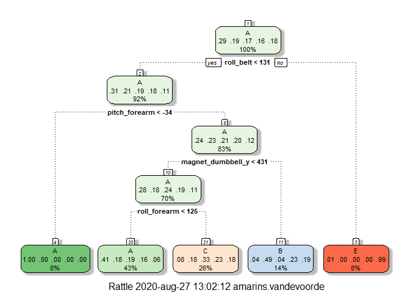

### Synopsis
In this article, a dataset regarding personal activity is investigated. 6 participants have taken measurements while performing barbell lifts, with accelerometers on the belt, forearm, arm, and dumbell. The data of these 4 accelerometers has been recorded, as well as a statement whether the exercise was performed correctly or incorrectly and in the latter case, in what way. This exercise classe has been recorded in the 'classe' variable. The goal of this article is to analyse the dataset and set up a model that will correctly predict the exercise classe for a second dataset that doesn't contain the classe variable.
For predicting the classe types, 3 prediction methods have been tested: prediction with a tree, prediction with boosting and prediction based on random forests.
The 3rd prediction method, based on random forest, was the only one with accuracy over 99%. This method has been chosen to predict the classe type for the validation dataset.

### Processing the data
#### Loading the dataset
The dataset consists of a training dataset and a testing dataset. The latter doesn't contain the _classe_ variable and has been used for validation. Hence, the training dataset has been split into a training and testing dataset. Code for loading the data is included in Appendix A01.


#### Processing the datasets
Some exploratory analysis was done on both the training and validation datasets, to investigate what kind of data has been included in the dataset. Full analyses have been included in appendix A02. 
The analyses show that both datasets contain almost the same columns. The only difference is that training contains column _classe_ and testing contains column _problem_id_ instead.
It appears that the _classe_ variable has been stored as a character. It will be converted to a factor variable, for easier processing.  
Further analysis shows that quite a number of columns don't seem to contain data. Looking at the full data frame confirms that these columns only contain data when field _new_window_ has value "yes". The headers of these columns seem to refer to statistical values, like average, sum or skewness, rather than to measured values. It appears as though the rows with _new_window_ value set to "yes" contain statistics. All these columns, as well as the "yes" rows have been excluded from the dataset, as the values are sparse and most likely dependent on the original measures.  
The first 7 columns of  the dataset seem to contain information about the measurement, rather than measured values, i.e. name of the participant, moment of exercise, etc. As these won't be relevant to the prediction, these columns have been removed from the datasets as well.
The resulting training, testing and validation dataset only contain measured values on the exercise and the _classe_ variable. 


### Fitting models
As the goal is to predict in which manner the participants did their exercise, the model will have to predict _classe_. Desired accuracy of the model is 99% or higher. 

The first fitted model is a tree. The accuracy was only 49%, so a different model is required.
The second fitted model uses boosting. Its accuracy is 96.7%, which is a lot better, but still no 99%.
The third fitted model is based on random forests. Its accuracy is 99.4% and should therefore be well equipped to predict the classe type of the validation set correctly.


```
##  Accuracy 
## 0.4920701
```

<!-- -->

```
##    user  system elapsed 
##   26.21    0.20  145.19
```

```
## Accuracy 
##  0.96202
```

```
##    user  system elapsed 
##   49.02    0.30  416.53
```

```
## Confusion Matrix and Statistics
## 
##           Reference
## Prediction    A    B    C    D    E
##          A 1357    9    0    0    0
##          B    0  919    4    0    0
##          C    1    1  830    5    0
##          D    0    0    2  783    2
##          E    0    0    0    0  879
## 
## Overall Statistics
##                                           
##                Accuracy : 0.995           
##                  95% CI : (0.9926, 0.9968)
##     No Information Rate : 0.2834          
##     P-Value [Acc > NIR] : < 2.2e-16       
##                                           
##                   Kappa : 0.9937          
##                                           
##  Mcnemar's Test P-Value : NA              
## 
## Statistics by Class:
## 
##                      Class: A Class: B Class: C Class: D Class: E
## Sensitivity            0.9993   0.9892   0.9928   0.9937   0.9977
## Specificity            0.9974   0.9990   0.9982   0.9990   1.0000
## Pos Pred Value         0.9934   0.9957   0.9916   0.9949   1.0000
## Neg Pred Value         0.9997   0.9974   0.9985   0.9988   0.9995
## Prevalence             0.2834   0.1939   0.1745   0.1644   0.1838
## Detection Rate         0.2832   0.1918   0.1732   0.1634   0.1834
## Detection Prevalence   0.2851   0.1926   0.1747   0.1642   0.1834
## Balanced Accuracy      0.9983   0.9941   0.9955   0.9963   0.9989
```

### Results
The 3rd model, based on random forests, will be used to predict the classe type for the Validation set.

```
##  [1] B A B A A E D B A A B C B A E E A B B B
## Levels: A B C D E
```

### Source of the data
The data for this project is the _Weight Lifting Exercise Database_, gathered from http://web.archive.org/web/20161224072740/http:/groupware.les.inf.puc-rio.br/har. 


### Appendix
#### A01 Loading packages and data; creating partitions

```r
list.of.packages <- c("caret","rattle","randomForest","klaR","doParallel","parallel")
new.packages <- list.of.packages[!(list.of.packages %in% installed.packages()[,"Package"])]
if(length(new.packages)) install.packages(new.packages)
invisible(lapply(list.of.packages,require,character.only=TRUE))
```


```r
train_url="https://d396qusza40orc.cloudfront.net/predmachlearn/pml-training.csv"
test_url="https://d396qusza40orc.cloudfront.net/predmachlearn/pml-testing.csv"
train<-read.csv(train_url)
validation<-read.csv(test_url)
set.seed(1234)
```


```r
inTrain<-createDataPartition(y=train$classe,p=0.75,list=FALSE)
training<-train[inTrain,]
testing<-train[-inTrain,]
```

#### A02 Exploratory analysis

```r
head(training,n=3L)
```

```
##   X user_name raw_timestamp_part_1 raw_timestamp_part_2   cvtd_timestamp
## 3 3  carlitos           1323084231               820366 05/12/2011 11:23
## 4 4  carlitos           1323084232               120339 05/12/2011 11:23
## 5 5  carlitos           1323084232               196328 05/12/2011 11:23
##   new_window num_window roll_belt pitch_belt yaw_belt total_accel_belt
## 3         no         11      1.42       8.07    -94.4                3
## 4         no         12      1.48       8.05    -94.4                3
## 5         no         12      1.48       8.07    -94.4                3
##   kurtosis_roll_belt kurtosis_picth_belt kurtosis_yaw_belt skewness_roll_belt
## 3                                                                            
## 4                                                                            
## 5                                                                            
##   skewness_roll_belt.1 skewness_yaw_belt max_roll_belt max_picth_belt
## 3                                                   NA             NA
## 4                                                   NA             NA
## 5                                                   NA             NA
##   max_yaw_belt min_roll_belt min_pitch_belt min_yaw_belt amplitude_roll_belt
## 3                         NA             NA                               NA
## 4                         NA             NA                               NA
## 5                         NA             NA                               NA
##   amplitude_pitch_belt amplitude_yaw_belt var_total_accel_belt avg_roll_belt
## 3                   NA                                      NA            NA
## 4                   NA                                      NA            NA
## 5                   NA                                      NA            NA
##   stddev_roll_belt var_roll_belt avg_pitch_belt stddev_pitch_belt
## 3               NA            NA             NA                NA
## 4               NA            NA             NA                NA
## 5               NA            NA             NA                NA
##   var_pitch_belt avg_yaw_belt stddev_yaw_belt var_yaw_belt gyros_belt_x
## 3             NA           NA              NA           NA         0.00
## 4             NA           NA              NA           NA         0.02
## 5             NA           NA              NA           NA         0.02
##   gyros_belt_y gyros_belt_z accel_belt_x accel_belt_y accel_belt_z
## 3         0.00        -0.02          -20            5           23
## 4         0.00        -0.03          -22            3           21
## 5         0.02        -0.02          -21            2           24
##   magnet_belt_x magnet_belt_y magnet_belt_z roll_arm pitch_arm yaw_arm
## 3            -2           600          -305     -128      22.5    -161
## 4            -6           604          -310     -128      22.1    -161
## 5            -6           600          -302     -128      22.1    -161
##   total_accel_arm var_accel_arm avg_roll_arm stddev_roll_arm var_roll_arm
## 3              34            NA           NA              NA           NA
## 4              34            NA           NA              NA           NA
## 5              34            NA           NA              NA           NA
##   avg_pitch_arm stddev_pitch_arm var_pitch_arm avg_yaw_arm stddev_yaw_arm
## 3            NA               NA            NA          NA             NA
## 4            NA               NA            NA          NA             NA
## 5            NA               NA            NA          NA             NA
##   var_yaw_arm gyros_arm_x gyros_arm_y gyros_arm_z accel_arm_x accel_arm_y
## 3          NA        0.02       -0.02       -0.02        -289         110
## 4          NA        0.02       -0.03        0.02        -289         111
## 5          NA        0.00       -0.03        0.00        -289         111
##   accel_arm_z magnet_arm_x magnet_arm_y magnet_arm_z kurtosis_roll_arm
## 3        -126         -368          344          513                  
## 4        -123         -372          344          512                  
## 5        -123         -374          337          506                  
##   kurtosis_picth_arm kurtosis_yaw_arm skewness_roll_arm skewness_pitch_arm
## 3                                                                         
## 4                                                                         
## 5                                                                         
##   skewness_yaw_arm max_roll_arm max_picth_arm max_yaw_arm min_roll_arm
## 3                            NA            NA          NA           NA
## 4                            NA            NA          NA           NA
## 5                            NA            NA          NA           NA
##   min_pitch_arm min_yaw_arm amplitude_roll_arm amplitude_pitch_arm
## 3            NA          NA                 NA                  NA
## 4            NA          NA                 NA                  NA
## 5            NA          NA                 NA                  NA
##   amplitude_yaw_arm roll_dumbbell pitch_dumbbell yaw_dumbbell
## 3                NA      12.85075      -70.27812    -85.14078
## 4                NA      13.43120      -70.39379    -84.87363
## 5                NA      13.37872      -70.42856    -84.85306
##   kurtosis_roll_dumbbell kurtosis_picth_dumbbell kurtosis_yaw_dumbbell
## 3                                                                     
## 4                                                                     
## 5                                                                     
##   skewness_roll_dumbbell skewness_pitch_dumbbell skewness_yaw_dumbbell
## 3                                                                     
## 4                                                                     
## 5                                                                     
##   max_roll_dumbbell max_picth_dumbbell max_yaw_dumbbell min_roll_dumbbell
## 3                NA                 NA                                 NA
## 4                NA                 NA                                 NA
## 5                NA                 NA                                 NA
##   min_pitch_dumbbell min_yaw_dumbbell amplitude_roll_dumbbell
## 3                 NA                                       NA
## 4                 NA                                       NA
## 5                 NA                                       NA
##   amplitude_pitch_dumbbell amplitude_yaw_dumbbell total_accel_dumbbell
## 3                       NA                                          37
## 4                       NA                                          37
## 5                       NA                                          37
##   var_accel_dumbbell avg_roll_dumbbell stddev_roll_dumbbell var_roll_dumbbell
## 3                 NA                NA                   NA                NA
## 4                 NA                NA                   NA                NA
## 5                 NA                NA                   NA                NA
##   avg_pitch_dumbbell stddev_pitch_dumbbell var_pitch_dumbbell avg_yaw_dumbbell
## 3                 NA                    NA                 NA               NA
## 4                 NA                    NA                 NA               NA
## 5                 NA                    NA                 NA               NA
##   stddev_yaw_dumbbell var_yaw_dumbbell gyros_dumbbell_x gyros_dumbbell_y
## 3                  NA               NA                0            -0.02
## 4                  NA               NA                0            -0.02
## 5                  NA               NA                0            -0.02
##   gyros_dumbbell_z accel_dumbbell_x accel_dumbbell_y accel_dumbbell_z
## 3             0.00             -232               46             -270
## 4            -0.02             -232               48             -269
## 5             0.00             -233               48             -270
##   magnet_dumbbell_x magnet_dumbbell_y magnet_dumbbell_z roll_forearm
## 3              -561               298               -63         28.3
## 4              -552               303               -60         28.1
## 5              -554               292               -68         28.0
##   pitch_forearm yaw_forearm kurtosis_roll_forearm kurtosis_picth_forearm
## 3         -63.9        -152                                             
## 4         -63.9        -152                                             
## 5         -63.9        -152                                             
##   kurtosis_yaw_forearm skewness_roll_forearm skewness_pitch_forearm
## 3                                                                  
## 4                                                                  
## 5                                                                  
##   skewness_yaw_forearm max_roll_forearm max_picth_forearm max_yaw_forearm
## 3                                    NA                NA                
## 4                                    NA                NA                
## 5                                    NA                NA                
##   min_roll_forearm min_pitch_forearm min_yaw_forearm amplitude_roll_forearm
## 3               NA                NA                                     NA
## 4               NA                NA                                     NA
## 5               NA                NA                                     NA
##   amplitude_pitch_forearm amplitude_yaw_forearm total_accel_forearm
## 3                      NA                                        36
## 4                      NA                                        36
## 5                      NA                                        36
##   var_accel_forearm avg_roll_forearm stddev_roll_forearm var_roll_forearm
## 3                NA               NA                  NA               NA
## 4                NA               NA                  NA               NA
## 5                NA               NA                  NA               NA
##   avg_pitch_forearm stddev_pitch_forearm var_pitch_forearm avg_yaw_forearm
## 3                NA                   NA                NA              NA
## 4                NA                   NA                NA              NA
## 5                NA                   NA                NA              NA
##   stddev_yaw_forearm var_yaw_forearm gyros_forearm_x gyros_forearm_y
## 3                 NA              NA            0.03           -0.02
## 4                 NA              NA            0.02           -0.02
## 5                 NA              NA            0.02            0.00
##   gyros_forearm_z accel_forearm_x accel_forearm_y accel_forearm_z
## 3            0.00             196             204            -213
## 4            0.00             189             206            -214
## 5           -0.02             189             206            -214
##   magnet_forearm_x magnet_forearm_y magnet_forearm_z classe
## 3              -18              658              469      A
## 4              -16              658              469      A
## 5              -17              655              473      A
```

```r
colnames(validation)
```

```
##   [1] "X"                        "user_name"               
##   [3] "raw_timestamp_part_1"     "raw_timestamp_part_2"    
##   [5] "cvtd_timestamp"           "new_window"              
##   [7] "num_window"               "roll_belt"               
##   [9] "pitch_belt"               "yaw_belt"                
##  [11] "total_accel_belt"         "kurtosis_roll_belt"      
##  [13] "kurtosis_picth_belt"      "kurtosis_yaw_belt"       
##  [15] "skewness_roll_belt"       "skewness_roll_belt.1"    
##  [17] "skewness_yaw_belt"        "max_roll_belt"           
##  [19] "max_picth_belt"           "max_yaw_belt"            
##  [21] "min_roll_belt"            "min_pitch_belt"          
##  [23] "min_yaw_belt"             "amplitude_roll_belt"     
##  [25] "amplitude_pitch_belt"     "amplitude_yaw_belt"      
##  [27] "var_total_accel_belt"     "avg_roll_belt"           
##  [29] "stddev_roll_belt"         "var_roll_belt"           
##  [31] "avg_pitch_belt"           "stddev_pitch_belt"       
##  [33] "var_pitch_belt"           "avg_yaw_belt"            
##  [35] "stddev_yaw_belt"          "var_yaw_belt"            
##  [37] "gyros_belt_x"             "gyros_belt_y"            
##  [39] "gyros_belt_z"             "accel_belt_x"            
##  [41] "accel_belt_y"             "accel_belt_z"            
##  [43] "magnet_belt_x"            "magnet_belt_y"           
##  [45] "magnet_belt_z"            "roll_arm"                
##  [47] "pitch_arm"                "yaw_arm"                 
##  [49] "total_accel_arm"          "var_accel_arm"           
##  [51] "avg_roll_arm"             "stddev_roll_arm"         
##  [53] "var_roll_arm"             "avg_pitch_arm"           
##  [55] "stddev_pitch_arm"         "var_pitch_arm"           
##  [57] "avg_yaw_arm"              "stddev_yaw_arm"          
##  [59] "var_yaw_arm"              "gyros_arm_x"             
##  [61] "gyros_arm_y"              "gyros_arm_z"             
##  [63] "accel_arm_x"              "accel_arm_y"             
##  [65] "accel_arm_z"              "magnet_arm_x"            
##  [67] "magnet_arm_y"             "magnet_arm_z"            
##  [69] "kurtosis_roll_arm"        "kurtosis_picth_arm"      
##  [71] "kurtosis_yaw_arm"         "skewness_roll_arm"       
##  [73] "skewness_pitch_arm"       "skewness_yaw_arm"        
##  [75] "max_roll_arm"             "max_picth_arm"           
##  [77] "max_yaw_arm"              "min_roll_arm"            
##  [79] "min_pitch_arm"            "min_yaw_arm"             
##  [81] "amplitude_roll_arm"       "amplitude_pitch_arm"     
##  [83] "amplitude_yaw_arm"        "roll_dumbbell"           
##  [85] "pitch_dumbbell"           "yaw_dumbbell"            
##  [87] "kurtosis_roll_dumbbell"   "kurtosis_picth_dumbbell" 
##  [89] "kurtosis_yaw_dumbbell"    "skewness_roll_dumbbell"  
##  [91] "skewness_pitch_dumbbell"  "skewness_yaw_dumbbell"   
##  [93] "max_roll_dumbbell"        "max_picth_dumbbell"      
##  [95] "max_yaw_dumbbell"         "min_roll_dumbbell"       
##  [97] "min_pitch_dumbbell"       "min_yaw_dumbbell"        
##  [99] "amplitude_roll_dumbbell"  "amplitude_pitch_dumbbell"
## [101] "amplitude_yaw_dumbbell"   "total_accel_dumbbell"    
## [103] "var_accel_dumbbell"       "avg_roll_dumbbell"       
## [105] "stddev_roll_dumbbell"     "var_roll_dumbbell"       
## [107] "avg_pitch_dumbbell"       "stddev_pitch_dumbbell"   
## [109] "var_pitch_dumbbell"       "avg_yaw_dumbbell"        
## [111] "stddev_yaw_dumbbell"      "var_yaw_dumbbell"        
## [113] "gyros_dumbbell_x"         "gyros_dumbbell_y"        
## [115] "gyros_dumbbell_z"         "accel_dumbbell_x"        
## [117] "accel_dumbbell_y"         "accel_dumbbell_z"        
## [119] "magnet_dumbbell_x"        "magnet_dumbbell_y"       
## [121] "magnet_dumbbell_z"        "roll_forearm"            
## [123] "pitch_forearm"            "yaw_forearm"             
## [125] "kurtosis_roll_forearm"    "kurtosis_picth_forearm"  
## [127] "kurtosis_yaw_forearm"     "skewness_roll_forearm"   
## [129] "skewness_pitch_forearm"   "skewness_yaw_forearm"    
## [131] "max_roll_forearm"         "max_picth_forearm"       
## [133] "max_yaw_forearm"          "min_roll_forearm"        
## [135] "min_pitch_forearm"        "min_yaw_forearm"         
## [137] "amplitude_roll_forearm"   "amplitude_pitch_forearm" 
## [139] "amplitude_yaw_forearm"    "total_accel_forearm"     
## [141] "var_accel_forearm"        "avg_roll_forearm"        
## [143] "stddev_roll_forearm"      "var_roll_forearm"        
## [145] "avg_pitch_forearm"        "stddev_pitch_forearm"    
## [147] "var_pitch_forearm"        "avg_yaw_forearm"         
## [149] "stddev_yaw_forearm"       "var_yaw_forearm"         
## [151] "gyros_forearm_x"          "gyros_forearm_y"         
## [153] "gyros_forearm_z"          "accel_forearm_x"         
## [155] "accel_forearm_y"          "accel_forearm_z"         
## [157] "magnet_forearm_x"         "magnet_forearm_y"        
## [159] "magnet_forearm_z"         "problem_id"
```

```r
summary(training)
```

```
##        X          user_name         raw_timestamp_part_1 raw_timestamp_part_2
##  Min.   :    3   Length:14718       Min.   :1.322e+09    Min.   :   294      
##  1st Qu.: 4902   Class :character   1st Qu.:1.323e+09    1st Qu.:248332      
##  Median : 9804   Mode  :character   Median :1.323e+09    Median :494707      
##  Mean   : 9815                      Mean   :1.323e+09    Mean   :497807      
##  3rd Qu.:14721                      3rd Qu.:1.323e+09    3rd Qu.:748295      
##  Max.   :19622                      Max.   :1.323e+09    Max.   :998749      
##                                                                              
##  cvtd_timestamp      new_window          num_window      roll_belt     
##  Length:14718       Length:14718       Min.   :  1.0   Min.   :-28.80  
##  Class :character   Class :character   1st Qu.:223.0   1st Qu.:  1.09  
##  Mode  :character   Mode  :character   Median :424.0   Median :113.00  
##                                        Mean   :430.9   Mean   : 64.23  
##                                        3rd Qu.:644.0   3rd Qu.:123.00  
##                                        Max.   :864.0   Max.   :162.00  
##                                                                        
##    pitch_belt          yaw_belt       total_accel_belt kurtosis_roll_belt
##  Min.   :-55.8000   Min.   :-179.00   Min.   : 0.0     Length:14718      
##  1st Qu.:  1.8300   1st Qu.: -88.30   1st Qu.: 3.0     Class :character  
##  Median :  5.2800   Median : -13.40   Median :17.0     Mode  :character  
##  Mean   :  0.3723   Mean   : -11.55   Mean   :11.3                       
##  3rd Qu.: 14.8000   3rd Qu.:  12.60   3rd Qu.:18.0                       
##  Max.   : 60.3000   Max.   : 179.00   Max.   :29.0                       
##                                                                          
##  kurtosis_picth_belt kurtosis_yaw_belt  skewness_roll_belt skewness_roll_belt.1
##  Length:14718        Length:14718       Length:14718       Length:14718        
##  Class :character    Class :character   Class :character   Class :character    
##  Mode  :character    Mode  :character   Mode  :character   Mode  :character    
##                                                                                
##                                                                                
##                                                                                
##                                                                                
##  skewness_yaw_belt  max_roll_belt     max_picth_belt  max_yaw_belt      
##  Length:14718       Min.   :-94.300   Min.   : 3.00   Length:14718      
##  Class :character   1st Qu.:-87.975   1st Qu.: 5.00   Class :character  
##  Mode  :character   Median : -5.350   Median :18.00   Mode  :character  
##                     Mean   : -4.136   Mean   :12.85                     
##                     3rd Qu.: 44.225   3rd Qu.:19.00                     
##                     Max.   :180.000   Max.   :30.00                     
##                     NA's   :14424     NA's   :14424                     
##  min_roll_belt      min_pitch_belt  min_yaw_belt       amplitude_roll_belt
##  Min.   :-180.000   Min.   : 0.00   Length:14718       Min.   :  0.000    
##  1st Qu.: -88.400   1st Qu.: 3.00   Class :character   1st Qu.:  0.400    
##  Median :  -8.700   Median :16.00   Mode  :character   Median :  1.000    
##  Mean   :  -8.619   Mean   :10.71                      Mean   :  4.481    
##  3rd Qu.:  16.225   3rd Qu.:17.00                      3rd Qu.:  2.022    
##  Max.   : 173.000   Max.   :23.00                      Max.   :360.000    
##  NA's   :14424      NA's   :14424                      NA's   :14424      
##  amplitude_pitch_belt amplitude_yaw_belt var_total_accel_belt avg_roll_belt   
##  Min.   : 0.000       Length:14718       Min.   : 0.000       Min.   :-20.90  
##  1st Qu.: 1.000       Class :character   1st Qu.: 0.100       1st Qu.:  1.10  
##  Median : 1.000       Mode  :character   Median : 0.200       Median :116.20  
##  Mean   : 2.136                          Mean   : 0.885       Mean   : 67.89  
##  3rd Qu.: 2.000                          3rd Qu.: 0.300       3rd Qu.:123.25  
##  Max.   :11.000                          Max.   :12.600       Max.   :157.40  
##  NA's   :14424                           NA's   :14424        NA's   :14424   
##  stddev_roll_belt var_roll_belt     avg_pitch_belt    stddev_pitch_belt
##  Min.   : 0.000   Min.   :  0.000   Min.   :-51.400   Min.   :0.00     
##  1st Qu.: 0.200   1st Qu.:  0.000   1st Qu.:  0.750   1st Qu.:0.20     
##  Median : 0.400   Median :  0.100   Median :  5.000   Median :0.40     
##  Mean   : 1.288   Mean   :  7.017   Mean   : -0.652   Mean   :0.62     
##  3rd Qu.: 0.700   3rd Qu.:  0.500   3rd Qu.: 14.200   3rd Qu.:0.70     
##  Max.   :14.200   Max.   :200.700   Max.   : 41.000   Max.   :4.00     
##  NA's   :14424    NA's   :14424     NA's   :14424     NA's   :14424    
##  var_pitch_belt    avg_yaw_belt      stddev_yaw_belt    var_yaw_belt      
##  Min.   : 0.000   Min.   :-138.300   Min.   :  0.000   Min.   :    0.000  
##  1st Qu.: 0.000   1st Qu.: -88.200   1st Qu.:  0.100   1st Qu.:    0.010  
##  Median : 0.100   Median :  -6.750   Median :  0.300   Median :    0.090  
##  Mean   : 0.826   Mean   :  -6.756   Mean   :  1.628   Mean   :  148.089  
##  3rd Qu.: 0.575   3rd Qu.:  21.625   3rd Qu.:  0.700   3rd Qu.:    0.472  
##  Max.   :16.200   Max.   : 173.500   Max.   :176.600   Max.   :31183.240  
##  NA's   :14424    NA's   :14424      NA's   :14424     NA's   :14424      
##   gyros_belt_x        gyros_belt_y      gyros_belt_z      accel_belt_x    
##  Min.   :-1.040000   Min.   :-0.6400   Min.   :-1.4600   Min.   :-81.000  
##  1st Qu.:-0.030000   1st Qu.: 0.0000   1st Qu.:-0.2000   1st Qu.:-21.000  
##  Median : 0.030000   Median : 0.0200   Median :-0.1000   Median :-15.000  
##  Mean   :-0.006694   Mean   : 0.0389   Mean   :-0.1309   Mean   : -5.695  
##  3rd Qu.: 0.110000   3rd Qu.: 0.1100   3rd Qu.: 0.0000   3rd Qu.: -5.000  
##  Max.   : 2.200000   Max.   : 0.6400   Max.   : 1.6100   Max.   : 85.000  
##                                                                           
##   accel_belt_y    accel_belt_z     magnet_belt_x    magnet_belt_y  
##  Min.   :-69.0   Min.   :-275.00   Min.   :-52.00   Min.   :354.0  
##  1st Qu.:  3.0   1st Qu.:-162.00   1st Qu.:  9.00   1st Qu.:581.0  
##  Median : 33.0   Median :-151.00   Median : 35.00   Median :601.0  
##  Mean   : 30.1   Mean   : -72.33   Mean   : 55.29   Mean   :593.6  
##  3rd Qu.: 61.0   3rd Qu.:  28.00   3rd Qu.: 59.00   3rd Qu.:610.0  
##  Max.   :150.0   Max.   : 105.00   Max.   :485.00   Max.   :673.0  
##                                                                    
##  magnet_belt_z       roll_arm         pitch_arm          yaw_arm         
##  Min.   :-623.0   Min.   :-180.00   Min.   :-88.800   Min.   :-180.0000  
##  1st Qu.:-375.0   1st Qu.: -31.20   1st Qu.:-25.675   1st Qu.: -42.9000  
##  Median :-320.0   Median :   0.00   Median :  0.000   Median :   0.0000  
##  Mean   :-346.1   Mean   :  17.83   Mean   : -4.664   Mean   :  -0.4879  
##  3rd Qu.:-306.0   3rd Qu.:  77.20   3rd Qu.: 10.875   3rd Qu.:  45.3750  
##  Max.   : 287.0   Max.   : 180.00   Max.   : 88.500   Max.   : 180.0000  
##                                                                          
##  total_accel_arm var_accel_arm      avg_roll_arm     stddev_roll_arm 
##  Min.   : 1.00   Min.   :  0.000   Min.   :-166.59   Min.   : 0.000  
##  1st Qu.:17.00   1st Qu.:  8.184   1st Qu.: -38.55   1st Qu.: 1.240  
##  Median :27.00   Median : 40.362   Median :   0.00   Median : 5.569  
##  Mean   :25.54   Mean   : 53.501   Mean   :  12.44   Mean   :10.518  
##  3rd Qu.:33.00   3rd Qu.: 74.231   3rd Qu.:  76.33   3rd Qu.:15.594  
##  Max.   :65.00   Max.   :331.699   Max.   : 163.33   Max.   :93.559  
##                  NA's   :14424     NA's   :14424     NA's   :14424   
##   var_roll_arm      avg_pitch_arm     stddev_pitch_arm var_pitch_arm     
##  Min.   :   0.000   Min.   :-81.773   Min.   : 0.000   Min.   :   0.000  
##  1st Qu.:   1.538   1st Qu.:-21.717   1st Qu.: 1.289   1st Qu.:   1.662  
##  Median :  31.015   Median :  0.000   Median : 7.947   Median :  63.153  
##  Mean   : 295.108   Mean   : -4.447   Mean   :10.284   Mean   : 196.149  
##  3rd Qu.: 243.229   3rd Qu.:  8.177   3rd Qu.:16.207   3rd Qu.: 262.691  
##  Max.   :8753.283   Max.   : 75.659   Max.   :43.412   Max.   :1884.565  
##  NA's   :14424      NA's   :14424     NA's   :14424    NA's   :14424     
##   avg_yaw_arm       stddev_yaw_arm    var_yaw_arm         gyros_arm_x      
##  Min.   :-173.283   Min.   :  0.00   Min.   :    0.000   Min.   :-6.37000  
##  1st Qu.: -32.179   1st Qu.:  2.21   1st Qu.:    4.886   1st Qu.:-1.33000  
##  Median :   0.000   Median : 16.96   Median :  287.693   Median : 0.06000  
##  Mean   :   0.306   Mean   : 22.16   Mean   : 1046.764   Mean   : 0.03544  
##  3rd Qu.:  32.661   3rd Qu.: 36.01   3rd Qu.: 1296.574   3rd Qu.: 1.56000  
##  Max.   : 150.458   Max.   :163.26   Max.   :26653.192   Max.   : 4.82000  
##  NA's   :14424      NA's   :14424    NA's   :14424                         
##   gyros_arm_y      gyros_arm_z       accel_arm_x       accel_arm_y     
##  Min.   :-3.440   Min.   :-2.2800   Min.   :-404.00   Min.   :-318.00  
##  1st Qu.:-0.800   1st Qu.:-0.0800   1st Qu.:-242.00   1st Qu.: -54.00  
##  Median :-0.240   Median : 0.2300   Median : -43.00   Median :  15.00  
##  Mean   :-0.253   Mean   : 0.2657   Mean   : -60.25   Mean   :  33.23  
##  3rd Qu.: 0.140   3rd Qu.: 0.7200   3rd Qu.:  84.00   3rd Qu.: 141.00  
##  Max.   : 2.840   Max.   : 3.0200   Max.   : 437.00   Max.   : 308.00  
##                                                                        
##   accel_arm_z       magnet_arm_x     magnet_arm_y     magnet_arm_z   
##  Min.   :-630.00   Min.   :-584.0   Min.   :-392.0   Min.   :-597.0  
##  1st Qu.:-144.75   1st Qu.:-302.0   1st Qu.:  -9.0   1st Qu.: 131.0  
##  Median : -48.00   Median : 282.0   Median : 203.0   Median : 444.0  
##  Mean   : -71.53   Mean   : 190.8   Mean   : 157.1   Mean   : 306.4  
##  3rd Qu.:  23.00   3rd Qu.: 637.0   3rd Qu.: 324.0   3rd Qu.: 544.0  
##  Max.   : 271.00   Max.   : 782.0   Max.   : 583.0   Max.   : 694.0  
##                                                                      
##  kurtosis_roll_arm  kurtosis_picth_arm kurtosis_yaw_arm   skewness_roll_arm 
##  Length:14718       Length:14718       Length:14718       Length:14718      
##  Class :character   Class :character   Class :character   Class :character  
##  Mode  :character   Mode  :character   Mode  :character   Mode  :character  
##                                                                             
##                                                                             
##                                                                             
##                                                                             
##  skewness_pitch_arm skewness_yaw_arm    max_roll_arm    max_picth_arm    
##  Length:14718       Length:14718       Min.   :-73.10   Min.   :-173.00  
##  Class :character   Class :character   1st Qu.:  0.00   1st Qu.:  -4.95  
##  Mode  :character   Mode  :character   Median :  4.55   Median :  21.60  
##                                        Mean   : 11.19   Mean   :  33.92  
##                                        3rd Qu.: 26.05   3rd Qu.:  91.70  
##                                        Max.   : 85.50   Max.   : 180.00  
##                                        NA's   :14424    NA's   :14424    
##   max_yaw_arm     min_roll_arm    min_pitch_arm      min_yaw_arm   
##  Min.   : 4.00   Min.   :-88.80   Min.   :-180.00   Min.   : 2.00  
##  1st Qu.:29.25   1st Qu.:-41.90   1st Qu.: -73.12   1st Qu.: 8.00  
##  Median :34.00   Median :-22.40   Median : -34.15   Median :13.00  
##  Mean   :35.61   Mean   :-20.96   Mean   : -36.19   Mean   :14.88  
##  3rd Qu.:41.00   3rd Qu.:  0.00   3rd Qu.:   0.00   3rd Qu.:20.00  
##  Max.   :62.00   Max.   : 66.40   Max.   : 140.00   Max.   :38.00  
##  NA's   :14424   NA's   :14424    NA's   :14424     NA's   :14424  
##  amplitude_roll_arm amplitude_pitch_arm amplitude_yaw_arm roll_dumbbell    
##  Min.   :  0.000    Min.   :  0.000     Min.   : 0.00     Min.   :-153.71  
##  1st Qu.:  5.125    1st Qu.:  9.885     1st Qu.:11.25     1st Qu.: -18.94  
##  Median : 28.130    Median : 56.600     Median :22.00     Median :  47.93  
##  Mean   : 32.143    Mean   : 70.116     Mean   :20.72     Mean   :  23.64  
##  3rd Qu.: 51.030    3rd Qu.:117.025     3rd Qu.:28.00     3rd Qu.:  67.45  
##  Max.   :119.500    Max.   :359.000     Max.   :52.00     Max.   : 153.38  
##  NA's   :14424      NA's   :14424       NA's   :14424                      
##  pitch_dumbbell     yaw_dumbbell      kurtosis_roll_dumbbell
##  Min.   :-148.50   Min.   :-150.871   Length:14718          
##  1st Qu.: -41.14   1st Qu.: -77.599   Class :character      
##  Median : -21.01   Median :  -4.153   Mode  :character      
##  Mean   : -10.92   Mean   :   1.753                         
##  3rd Qu.:  17.44   3rd Qu.:  79.969                         
##  Max.   : 149.40   Max.   : 154.952                         
##                                                             
##  kurtosis_picth_dumbbell kurtosis_yaw_dumbbell skewness_roll_dumbbell
##  Length:14718            Length:14718          Length:14718          
##  Class :character        Class :character      Class :character      
##  Mode  :character        Mode  :character      Mode  :character      
##                                                                      
##                                                                      
##                                                                      
##                                                                      
##  skewness_pitch_dumbbell skewness_yaw_dumbbell max_roll_dumbbell
##  Length:14718            Length:14718          Min.   :-70.10   
##  Class :character        Class :character      1st Qu.:-27.27   
##  Mode  :character        Mode  :character      Median :  9.05   
##                                                Mean   : 11.97   
##                                                3rd Qu.: 48.15   
##                                                Max.   :126.80   
##                                                NA's   :14424    
##  max_picth_dumbbell max_yaw_dumbbell   min_roll_dumbbell min_pitch_dumbbell
##  Min.   :-112.90    Length:14718       Min.   :-149.60   Min.   :-146.20   
##  1st Qu.: -68.30    Class :character   1st Qu.: -60.12   1st Qu.: -92.33   
##  Median :  31.55    Mode  :character   Median : -42.60   Median : -68.50   
##  Mean   :  27.71                       Mean   : -40.51   Mean   : -34.39   
##  3rd Qu.: 129.90                       3rd Qu.: -24.68   3rd Qu.:  16.60   
##  Max.   : 155.00                       Max.   :  73.20   Max.   : 120.90   
##  NA's   :14424                         NA's   :14424     NA's   :14424     
##  min_yaw_dumbbell   amplitude_roll_dumbbell amplitude_pitch_dumbbell
##  Length:14718       Min.   :  0.00          Min.   :  0.00          
##  Class :character   1st Qu.: 13.59          1st Qu.: 16.62          
##  Mode  :character   Median : 33.01          Median : 38.98          
##                     Mean   : 52.48          Mean   : 62.10          
##                     3rd Qu.: 75.69          3rd Qu.: 94.14          
##                     Max.   :236.55          Max.   :263.60          
##                     NA's   :14424           NA's   :14424           
##  amplitude_yaw_dumbbell total_accel_dumbbell var_accel_dumbbell
##  Length:14718           Min.   : 0.00        Min.   :  0.000   
##  Class :character       1st Qu.: 4.00        1st Qu.:  0.348   
##  Mode  :character       Median :10.00        Median :  1.071   
##                         Mean   :13.76        Mean   :  4.579   
##                         3rd Qu.:20.00        3rd Qu.:  3.434   
##                         Max.   :58.00        Max.   :230.428   
##                                              NA's   :14424     
##  avg_roll_dumbbell stddev_roll_dumbbell var_roll_dumbbell  avg_pitch_dumbbell
##  Min.   :-128.96   Min.   :  0.000      Min.   :    0.00   Min.   :-70.53    
##  1st Qu.: -20.83   1st Qu.:  4.642      1st Qu.:   21.55   1st Qu.:-42.39    
##  Median :  50.09   Median : 10.630      Median :  113.00   Median :-21.74    
##  Mean   :  23.13   Mean   : 19.884      Mean   :  983.88   Mean   :-12.75    
##  3rd Qu.:  64.70   3rd Qu.: 23.963      3rd Qu.:  574.25   3rd Qu.: 13.03    
##  Max.   : 125.99   Max.   :123.778      Max.   :15321.01   Max.   : 94.28    
##  NA's   :14424     NA's   :14424        NA's   :14424      NA's   :14424     
##  stddev_pitch_dumbbell var_pitch_dumbbell avg_yaw_dumbbell  
##  Min.   : 0.000        Min.   :   0.00    Min.   :-117.950  
##  1st Qu.: 3.185        1st Qu.:  10.15    1st Qu.: -77.263  
##  Median : 7.499        Median :  56.23    Median : -11.827  
##  Mean   :12.307        Mean   : 313.98    Mean   :  -3.529  
##  3rd Qu.:17.683        3rd Qu.: 312.70    3rd Qu.:  69.517  
##  Max.   :82.680        Max.   :6836.02    Max.   : 134.905  
##  NA's   :14424         NA's   :14424      NA's   :14424     
##  stddev_yaw_dumbbell var_yaw_dumbbell   gyros_dumbbell_x    gyros_dumbbell_y 
##  Min.   :  0.000     Min.   :    0.00   Min.   :-204.0000   Min.   :-2.1000  
##  1st Qu.:  3.855     1st Qu.:   14.86   1st Qu.:  -0.0300   1st Qu.:-0.1400  
##  Median :  9.339     Median :   87.22   Median :   0.1400   Median : 0.0300  
##  Mean   : 15.238     Mean   :  486.05   Mean   :   0.1593   Mean   : 0.0455  
##  3rd Qu.: 23.251     3rd Qu.:  540.61   3rd Qu.:   0.3500   3rd Qu.: 0.2100  
##  Max.   :107.088     Max.   :11467.91   Max.   :   2.2000   Max.   :52.0000  
##  NA's   :14424       NA's   :14424                                           
##  gyros_dumbbell_z   accel_dumbbell_x  accel_dumbbell_y  accel_dumbbell_z 
##  Min.   : -2.3800   Min.   :-419.00   Min.   :-189.00   Min.   :-334.00  
##  1st Qu.: -0.3100   1st Qu.: -51.00   1st Qu.:  -9.00   1st Qu.:-142.00  
##  Median : -0.1300   Median :  -8.50   Median :  42.00   Median :  -1.00  
##  Mean   : -0.1253   Mean   : -28.98   Mean   :  52.68   Mean   : -38.52  
##  3rd Qu.:  0.0300   3rd Qu.:  11.00   3rd Qu.: 111.00   3rd Qu.:  39.00  
##  Max.   :317.0000   Max.   : 235.00   Max.   : 315.00   Max.   : 318.00  
##                                                                          
##  magnet_dumbbell_x magnet_dumbbell_y magnet_dumbbell_z  roll_forearm    
##  Min.   :-643.0    Min.   :-3600.0   Min.   :-262.00   Min.   :-180.00  
##  1st Qu.:-535.0    1st Qu.:  231.0   1st Qu.: -45.00   1st Qu.:  -0.37  
##  Median :-478.5    Median :  310.0   Median :  14.00   Median :  23.35  
##  Mean   :-327.7    Mean   :  220.2   Mean   :  46.69   Mean   :  34.80  
##  3rd Qu.:-303.2    3rd Qu.:  391.0   3rd Qu.:  95.00   3rd Qu.: 141.00  
##  Max.   : 592.0    Max.   :  633.0   Max.   : 452.00   Max.   : 180.00  
##                                                                         
##  pitch_forearm     yaw_forearm      kurtosis_roll_forearm
##  Min.   :-72.50   Min.   :-180.00   Length:14718         
##  1st Qu.:  0.00   1st Qu.: -68.28   Class :character     
##  Median :  9.31   Median :   0.00   Mode  :character     
##  Mean   : 10.69   Mean   :  19.15                        
##  3rd Qu.: 28.50   3rd Qu.: 110.00                        
##  Max.   : 89.80   Max.   : 180.00                        
##                                                          
##  kurtosis_picth_forearm kurtosis_yaw_forearm skewness_roll_forearm
##  Length:14718           Length:14718         Length:14718         
##  Class :character       Class :character     Class :character     
##  Mode  :character       Mode  :character     Mode  :character     
##                                                                   
##                                                                   
##                                                                   
##                                                                   
##  skewness_pitch_forearm skewness_yaw_forearm max_roll_forearm max_picth_forearm
##  Length:14718           Length:14718         Min.   :-66.60   Min.   :-151.00  
##  Class :character       Class :character     1st Qu.:  0.00   1st Qu.:   0.00  
##  Mode  :character       Mode  :character     Median : 27.00   Median : 111.50  
##                                              Mean   : 24.67   Mean   :  81.56  
##                                              3rd Qu.: 46.70   3rd Qu.: 175.00  
##                                              Max.   : 89.80   Max.   : 180.00  
##                                              NA's   :14424    NA's   :14424    
##  max_yaw_forearm    min_roll_forearm  min_pitch_forearm min_yaw_forearm   
##  Length:14718       Min.   :-69.400   Min.   :-180.00   Length:14718      
##  Class :character   1st Qu.: -6.575   1st Qu.:-175.00   Class :character  
##  Mode  :character   Median :  0.000   Median : -58.85   Mode  :character  
##                     Mean   :  0.353   Mean   : -57.40                     
##                     3rd Qu.: 12.800   3rd Qu.:   0.00                     
##                     Max.   : 62.100   Max.   : 167.00                     
##                     NA's   :14424     NA's   :14424                       
##  amplitude_roll_forearm amplitude_pitch_forearm amplitude_yaw_forearm
##  Min.   :  0.000        Min.   :  0.000         Length:14718         
##  1st Qu.:  1.005        1st Qu.:  1.075         Class :character     
##  Median : 17.110        Median : 84.600         Mode  :character     
##  Mean   : 24.313        Mean   :138.955                              
##  3rd Qu.: 40.100        3rd Qu.:350.000                              
##  Max.   :126.000        Max.   :360.000                              
##  NA's   :14424          NA's   :14424                                
##  total_accel_forearm var_accel_forearm avg_roll_forearm  stddev_roll_forearm
##  Min.   :  0.00      Min.   :  0.000   Min.   :-177.13   Min.   :  0.000    
##  1st Qu.: 29.00      1st Qu.:  6.239   1st Qu.:   0.00   1st Qu.:  0.325    
##  Median : 36.00      Median : 20.037   Median :  12.78   Median :  7.219    
##  Mean   : 34.71      Mean   : 31.823   Mean   :  35.69   Mean   : 42.672    
##  3rd Qu.: 41.00      3rd Qu.: 47.365   3rd Qu.: 109.13   3rd Qu.: 86.157    
##  Max.   :108.00      Max.   :172.606   Max.   : 177.26   Max.   :179.171    
##                      NA's   :14424     NA's   :14424     NA's   :14424      
##  var_roll_forearm   avg_pitch_forearm stddev_pitch_forearm var_pitch_forearm 
##  Min.   :    0.00   Min.   :-68.17    Min.   : 0.000       Min.   :   0.000  
##  1st Qu.:    0.11   1st Qu.:  0.00    1st Qu.: 0.298       1st Qu.:   0.089  
##  Median :   52.11   Median : 11.97    Median : 5.324       Median :  28.340  
##  Mean   : 5386.39   Mean   : 12.27    Mean   : 7.920       Mean   : 142.227  
##  3rd Qu.: 7423.03   3rd Qu.: 28.18    3rd Qu.:12.866       3rd Qu.: 165.537  
##  Max.   :32102.24   Max.   : 72.09    Max.   :47.745       Max.   :2279.617  
##  NA's   :14424      NA's   :14424     NA's   :14424        NA's   :14424     
##  avg_yaw_forearm   stddev_yaw_forearm var_yaw_forearm    gyros_forearm_x   
##  Min.   :-155.06   Min.   :  0.000    Min.   :    0.00   Min.   :-22.0000  
##  1st Qu.: -23.12   1st Qu.:  0.505    1st Qu.:    0.26   1st Qu.: -0.2200  
##  Median :   0.00   Median : 25.012    Median :  625.77   Median :  0.0500  
##  Mean   :  19.65   Mean   : 45.269    Mean   : 4769.73   Mean   :  0.1549  
##  3rd Qu.:  86.92   3rd Qu.: 85.817    3rd Qu.: 7368.41   3rd Qu.:  0.5600  
##  Max.   : 169.24   Max.   :197.508    Max.   :39009.33   Max.   :  3.9700  
##  NA's   :14424     NA's   :14424      NA's   :14424                        
##  gyros_forearm_y     gyros_forearm_z   accel_forearm_x   accel_forearm_y 
##  Min.   : -7.02000   Min.   : -6.990   Min.   :-498.00   Min.   :-632.0  
##  1st Qu.: -1.46000   1st Qu.: -0.180   1st Qu.:-177.00   1st Qu.:  57.0  
##  Median :  0.03000   Median :  0.080   Median : -57.00   Median : 201.0  
##  Mean   :  0.08038   Mean   :  0.156   Mean   : -60.93   Mean   : 163.9  
##  3rd Qu.:  1.62000   3rd Qu.:  0.490   3rd Qu.:  77.00   3rd Qu.: 312.0  
##  Max.   :311.00000   Max.   :231.000   Max.   : 381.00   Max.   : 923.0  
##                                                                          
##  accel_forearm_z   magnet_forearm_x  magnet_forearm_y magnet_forearm_z classe  
##  Min.   :-446.00   Min.   :-1280.0   Min.   :-896.0   Min.   :-973.0   A:4185  
##  1st Qu.:-182.00   1st Qu.: -615.0   1st Qu.:   2.0   1st Qu.: 191.0   B:2848  
##  Median : -40.00   Median : -377.0   Median : 592.0   Median : 512.0   C:2567  
##  Mean   : -55.35   Mean   : -311.4   Mean   : 379.3   Mean   : 394.2   D:2412  
##  3rd Qu.:  26.00   3rd Qu.:  -73.0   3rd Qu.: 736.0   3rd Qu.: 653.0   E:2706  
##  Max.   : 287.00   Max.   :  672.0   Max.   :1480.0   Max.   :1080.0           
## 
```

```r
#training$classe<-as.factor(training$classe)
#testing$classe<-as.factor(testing$classe)
```

#### A03 Data preparation

```r
training.nona.temp<-training[training$new_window!="yes",]
training.nona<-training.nona.temp[,!grepl("kurtosis|skewness|max|min|amplitude|var|avg|stddev|window|X|user|timestamp",colnames(training.nona.temp))]
rm(training.nona.temp)

testing.nona.temp<-testing[testing$new_window!="yes",]
testing.nona<-testing.nona.temp[,!grepl("kurtosis|skewness|max|min|amplitude|var|avg|stddev|window|X|user|timestamp",colnames(testing.nona.temp))]
rm(testing.nona.temp)

validation.nona.temp<-validation[validation$new_window!="yes",]
validation.nona<-validation.nona.temp[,!grepl("kurtosis|skewness|max|min|amplitude|var|avg|stddev|X|window|user|timestamp",colnames(validation.nona.temp))]
rm(validation.nona.temp)
```

#### A04 Creating models

```r
mod1<-train(classe~.,method="rpart",data=training.nona)
predict1<-predict(mod1,testing.nona)
Accuracy_mod1<-confusionMatrix(predict1,testing.nona$classe)$overall[1]
print(Accuracy_mod1)
fancyRpartPlot(mod1$finalModel)

cluster2<-makeCluster(detectCores()-1)
registerDoParallel(cluster2)
fitControl2<-trainControl(method="cv",number=5,allowParallel=TRUE)
system.time(mod2<-train(classe~.,method="gbm",data=training.nona,verbose=FALSE,trControl=fitControl2))
stopCluster(cluster2)
registerDoSEQ()
predict2<-predict(mod2,testing.nona)
Accuracy_mod2<-confusionMatrix(predict2,testing.nona$classe)$overall[1]
print(Accuracy_mod2)

cluster3<-makeCluster(detectCores()-1)
registerDoParallel(cluster3)
fitControl3<-trainControl(method="cv",number=5,allowParallel=TRUE)
system.time(mod3<-train(classe~.,method="rf",data=training.nona,trControl=fitControl3))
stopCluster(cluster3)
registerDoSEQ()
predict3<-predict(mod3,testing.nona)
Accuracy_mod3<-confusionMatrix(predict3,testing.nona$classe)$overall[1]
print(Accuracy_mod3)
```

